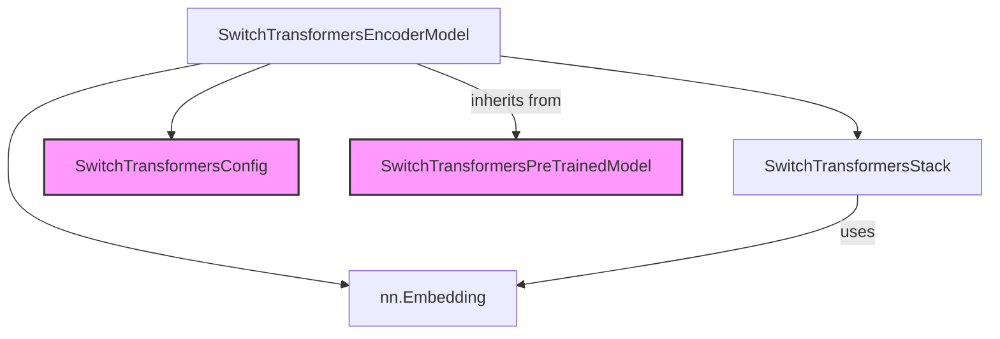

# encoder_models

The `encoder_models` module, a sub-module within `switch_transformers_models`, provides the core encoder architecture for the Switch Transformers model. It primarily encapsulates the `SwitchTransformersEncoderModel` class, which is responsible for processing input sequences and generating contextualized representations. This module is essential for tasks requiring powerful encoding capabilities, particularly in large-scale language models utilizing the Switch Transformer architecture.

## Core Functionality

The `SwitchTransformersEncoderModel` is the central component of this module. It is designed to handle the encoding phase of the Switch Transformer, leveraging a shared embedding layer and a `SwitchTransformersStack` for its operations.

### `SwitchTransformersEncoderModel`

```python
class SwitchTransformersEncoderModel(SwitchTransformersPreTrainedModel):
    _tied_weights_keys = {
        "encoder.embed_tokens.weight": "shared.weight",
    }

    def __init__(self, config: SwitchTransformersConfig):
        super().__init__(config)
        self.shared = nn.Embedding(config.vocab_size, config.d_model)

        encoder_config = copy.deepcopy(config)
        encoder_config.use_cache = False
        encoder_config.is_encoder_decoder = False
        self.encoder = SwitchTransformersStack(encoder_config)
        self.post_init()

    def get_input_embeddings(self):
        return self.shared

    def set_input_embeddings(self, new_embeddings):
        self.shared = new_embeddings
        self.encoder.set_input_embeddings(new_embeddings)

    @auto_docstring
    @can_return_tuple
    def forward(
        self,
        input_ids: torch.LongTensor | None = None,
        attention_mask: torch.FloatTensor | None = None,
        inputs_embeds: torch.FloatTensor | None = None,
        use_cache: bool | None = None,
        **kwargs: Unpack[TransformersKwargs],
    ) -> tuple[torch.FloatTensor] | MoEModelOutput:
        use_cache = False
        encoder_outputs = self.encoder(
            input_ids=input_ids,
            attention_mask=attention_mask,
            inputs_embeds=inputs_embeds,
            use_cache=use_cache,
            **kwargs,
        )

        return encoder_outputs
```

This class:
*   **Initialization**: Takes a `SwitchTransformersConfig` object to configure its layers. It initializes a shared `nn.Embedding` layer for input tokens and a `SwitchTransformersStack` which constitutes the main encoder layers.
*   **Input Embeddings**: Provides methods (`get_input_embeddings` and `set_input_embeddings`) to access and modify the shared input embedding layer. This allows for flexible handling of token embeddings, potentially enabling weight sharing with other parts of a larger model (e.g., a decoder).
*   **Forward Pass**: The `forward` method processes `input_ids` or `inputs_embeds` along with an `attention_mask` through the `SwitchTransformersStack` to produce encoder outputs. It ensures `use_cache` is set to `False` for the encoder stack.

## Architecture and Component Relationships

The `encoder_models` module is built around the `SwitchTransformersEncoderModel` which orchestrates the encoding process. It relies on the `SwitchTransformersStack` for the actual transformer layers and `nn.Embedding` for converting input tokens into dense vector representations. The configuration for these components is provided by `SwitchTransformersConfig`.

<!-- DIAGRAM_JSON
{
    "direction": "TD",
    "nodes": [
        {"id": "encoder_model", "label": "SwitchTransformersEncoderModel", "type": "component", "link": null},
        {"id": "encoder_stack", "label": "SwitchTransformersStack", "type": "component", "link": null},
        {"id": "shared_embeddings", "label": "nn.Embedding", "type": "component", "link": null},
        {"id": "switch_transformers_config", "label": "SwitchTransformersConfig", "type": "external", "link": "switch_transformers_models.md"},
        {"id": "switch_transformers_pretrained_model", "label": "SwitchTransformersPreTrainedModel", "type": "external", "link": "switch_transformers_models.md"}
    ],
    "edges": [
        {"source": "encoder_model", "target": "encoder_stack"},
        {"source": "encoder_model", "target": "shared_embeddings"},
        {"source": "encoder_model", "target": "switch_transformers_config"},
        {"source": "encoder_model", "target": "switch_transformers_pretrained_model", "label": "inherits from"},
        {"source": "encoder_stack", "target": "shared_embeddings", "label": "uses"}
    ],
    "groups": []
}
-->


*   **`SwitchTransformersEncoderModel`**: The main class within this module, acting as the entry point for encoder operations.
*   **`SwitchTransformersStack`**: An internal component responsible for the multi-layer transformer encoder architecture. It is instantiated and utilized by `SwitchTransformersEncoderModel`.
*   **`nn.Embedding`**: A standard PyTorch module used for token embeddings. It's shared and managed by `SwitchTransformersEncoderModel` and passed to `SwitchTransformersStack`.
*   **`SwitchTransformersConfig`**: Defines the model's architecture parameters and is crucial for initializing both `SwitchTransformersEncoderModel` and `SwitchTransformersStack`. For more details, refer to the [switch_transformers_models documentation](switch_transformers_models.md).
*   **`SwitchTransformersPreTrainedModel`**: The base class that `SwitchTransformersEncoderModel` inherits from, providing common functionalities for pre-trained models within the `switch_transformers_models` family. For more details, refer to the [switch_transformers_models documentation](switch_transformers_models.md).

## How the Module Fits into the Overall System

The `encoder_models` module is a fundamental part of the larger [switch_transformers_models](switch_transformers_models.md) system. It specifically handles the encoder portion of the Switch Transformer architecture, which is typically used in encoder-decoder models or as a standalone encoder for various natural language processing tasks.

In a full Switch Transformer setup, the output of this encoder module would be passed to a decoder module (if present) for sequence-to-sequence tasks, or used directly for tasks like text classification or feature extraction. Its design promotes modularity, allowing the encoder to be used independently or integrated seamlessly into more complex model architectures.
