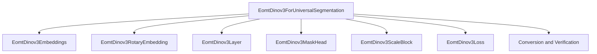

# EomtDinov3 Model Architecture

## Introduction
The `eomt_dinov3_model_architecture` module provides the core model implementation for universal image segmentation, primarily through the `EomtDinov3ForUniversalSegmentation` class. This model is designed to perform both instance and semantic segmentation tasks by generating masks and class labels for various objects within an image. It incorporates a sophisticated transformer-based architecture with dynamic attention mechanisms, inspired by the DinoV3 framework, to effectively localize and classify visual elements.

## Architecture and Core Functionality
The `EomtDinov3ForUniversalSegmentation` model's architecture is meticulously designed and can be broken down into several key components that work in conjunction to achieve universal segmentation:

1.  **Input Embeddings (`EomtDinov3Embeddings`, `EomtDinov3RotaryEmbedding`)**:
    *   The process begins with `EomtDinov3Embeddings` which takes raw `pixel_values` (input images) and transforms them into initial hidden states. These embeddings represent the visual features of the image patches.
    *   Complementing the patch embeddings, `EomtDinov3RotaryEmbedding` provides crucial positional encoding, helping the model understand the spatial relationships between different parts of the image.

2.  **Transformer Layers (`EomtDinov3Layer`)**:
    *   The model employs a stack of `EomtDinov3Layer` modules. These layers form the backbone of the architecture, iteratively processing the hidden states through self-attention mechanisms and feed-forward networks to extract rich contextual features.

3.  **Query Tokens**:
    *   At a specific stage within the transformer stack (controlled by `config.num_blocks`), a set of learnable `query` embeddings are introduced. These queries are concatenated with the image's hidden states, acting as dynamic probes designed to focus on different objects or regions within the image.

4.  **Dynamic Attention Masking**:
    *   A significant feature of this architecture is its dynamic attention mask construction. During the forward pass, intermediate mask predictions are generated. These predictions are then used to dynamically create an `attention_mask` that guides the attention mechanism. This allows query tokens to intelligently focus on relevant encoder tokens (image patches) based on preliminary segmentation logits, greatly enhancing the model's ability to accurately localize objects.
    *   The `_disable_attention_mask` static method also provides a mechanism for randomly disabling attention to certain query tokens during training, which can serve as a regularization technique.

5.  **Prediction Heads (`EomtDinov3MaskHead`, `EomtDinov3ScaleBlock`, `class_predictor`)**:
    *   **Mask Head (`EomtDinov3MaskHead`)**: This component refines the processed query tokens to generate precise pixel-level mask predictions for the identified objects.
    *   **Upscale Block (`EomtDinov3ScaleBlock`)**: Prior to mask generation, this block is responsible for upscaling the image's prefix tokens (derived from the transformer encoder) to a higher resolution. This prepares the features for detailed mask prediction.
    *   **Class Predictor (`nn.Linear`)**: A standard linear layer that takes the refined query tokens and predicts the semantic class label for each detected object or segment.

6.  **Loss Function (`EomtDinov3Loss`)**:
    *   For training, the model utilizes a composite loss function encapsulated within `EomtDinov3Loss`. This criterion combines multiple loss components, typically including cross-entropy for classification, mask loss, and Dice loss for segmentation quality. These losses are applied per layer during training, with their contributions weighted by configurable parameters such as `config.class_weight`, `config.mask_weight`, and `config.dice_weight`.

## Component Relationships
*   The `EomtDinov3ForUniversalSegmentation` class acts as the central orchestrator, initializing and managing all sub-components.
*   It directly utilizes `EomtDinov3Embeddings` and `EomtDinov3RotaryEmbedding` for initial data processing and positional awareness.
*   A series of `EomtDinov3Layer` instances are sequentially called to build hierarchical representations.
*   The `EomtDinov3MaskHead`, `EomtDinov3ScaleBlock`, and the internal `class_predictor` are key for transforming intermediate features into final segmentation outputs.
*   The `EomtDinov3Loss` component is crucial for supervising the model's learning process by comparing predictions against ground truth labels.

## Integration with the Overall System
This `eomt_dinov3_model_architecture` module, focusing on `EomtDinov3ForUniversalSegmentation`, is a specialized universal segmentation model integrated within the broader Hugging Face `transformers` library. It is designed for high adaptability across diverse segmentation tasks, accepting raw pixel data and producing comprehensive mask and class predictions. The advanced features like dynamic attention and learnable queries make it particularly well-suited for tackling complex visual understanding challenges. The presence of a related [conversion_and_verification](eomt_dinov3_conversion_and_verification.md) submodule within the `eomt_dinov3_models` family suggests support for loading pre-trained weights or interacting with external model formats, thereby streamlining its deployment and facilitating research applications within the `transformers` ecosystem.

<!-- DIAGRAM_JSON
{
    "direction": "TD",
    "nodes": [
        {"id": "eomt_dinov3_segmentation", "label": "EomtDinov3ForUniversalSegmentation", "type": "component", "link": null},
        {"id": "embeddings", "label": "EomtDinov3Embeddings", "type": "component", "link": null},
        {"id": "rotary_embedding", "label": "EomtDinov3RotaryEmbedding", "type": "component", "link": null},
        {"id": "transformer_layer", "label": "EomtDinov3Layer", "type": "component", "link": null},
        {"id": "mask_head", "label": "EomtDinov3MaskHead", "type": "component", "link": null},
        {"id": "upscale_block", "label": "EomtDinov3ScaleBlock", "type": "component", "link": null},
        {"id": "loss_criterion", "label": "EomtDinov3Loss", "type": "component", "link": null},
        {"id": "conversion_verification", "label": "Conversion and Verification", "type": "external", "link": "eomt_dinov3_conversion_and_verification.md"}
    ],
    "edges": [
        {"source": "eomt_dinov3_segmentation", "target": "embeddings"},
        {"source": "eomt_dinov3_segmentation", "target": "rotary_embedding"},
        {"source": "eomt_dinov3_segmentation", "target": "transformer_layer"},
        {"source": "eomt_dinov3_segmentation", "target": "mask_head"},
        {"source": "eomt_dinov3_segmentation", "target": "upscale_block"},
        {"source": "eomt_dinov3_segmentation", "target": "loss_criterion"},
        {"source": "eomt_dinov3_segmentation", "target": "conversion_verification"}
    ],
    "groups": []
}
-->

