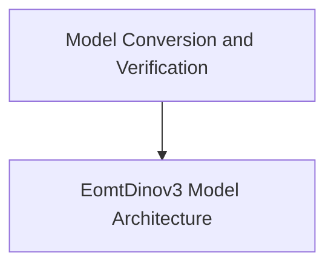

# EomtDinov3 Models Documentation

## Introduction

The `eomt_dinov3_models` module provides the implementation for the EomtDinov3 model, specifically designed for universal segmentation tasks. It includes functionalities for model architecture, forward pass, loss calculation, and conversion verification from original checkpoints to Hugging Face format.

## Architecture Overview

The EomtDinov3 model is composed of several key components that work together to perform universal segmentation. The core architecture focuses on processing pixel values through embeddings, a series of transformer layers, and specialized heads for mask and class prediction. It also incorporates robust conversion and verification utilities to ensure compatibility and correctness.

<!-- DIAGRAM_JSON
{
    "direction": "TD",
    "nodes": [
        {"id": "model_architecture", "label": "EomtDinov3 Model Architecture", "type": "module", "link": "model_architecture.md"},
        {"id": "conversion_and_verification", "label": "Model Conversion and Verification", "type": "module", "link": "conversion_and_verification.md"}
    ],
    "edges": [
        {"source": "conversion_and_verification", "target": "model_architecture"}
    ],
    "groups": []
}
-->

## Sub-modules

### [EomtDinov3 Model Architecture](model_architecture.md)
This sub-module details the EomtDinov3ForUniversalSegmentation model, including its layers, embeddings, and forward pass for universal segmentation tasks.

### [Model Conversion and Verification](conversion_and_verification.md)
This sub-module handles the conversion and verification of EomtDinov3 checkpoints from original sources to Hugging Face format, ensuring integrity and functionality.
