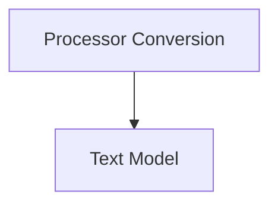

# ERNIE 4.5 VL MoE Models

This module encapsulates the core components for the ERNIE 4.5 VL MoE (Vision-Language Mixture-of-Experts) models, focusing on processor conversion and the text model architecture. It facilitates the integration and use of ERNIE 4.5 VL MoE models within the Hugging Face Transformers ecosystem.

## Architecture Overview

The `ernie4_5_vl_moe_models` module is structured into two main sub-modules:

- **Processor Conversion**: Handles the conversion of the ERNIE 4.5 VL MoE processor.
- **Text Model**: Defines the text-specific model component of ERNIE 4.5 VL MoE.

<!-- DIAGRAM_JSON
{
    "direction": "TD",
    "nodes": [
        {"id": "processor_conversion", "label": "Processor Conversion", "type": "module", "link": "processor_conversion.md"},
        {"id": "text_model", "label": "Text Model", "type": "module", "link": "text_model.md"}
    ],
    "edges": [
        {"source": "processor_conversion", "target": "text_model"}
    ],
    "groups": []
}
-->

## Sub-modules

### [Processor Conversion](processor_conversion.md)

This sub-module is responsible for converting the original ERNIE 4.5 VL MoE processor components, including the tokenizer, image processor, and video processor, into a format compatible with Hugging Face Transformers. It ensures all necessary assets, such as fonts for the video processor, are correctly handled during the conversion process.

### [Text Model](text_model.md)

The `text_model` sub-module defines the `Ernie4_5_VL_MoeTextModel`, which serves as the text-specific component of the ERNIE 4.5 VL MoE architecture. It includes mechanisms for backward compatibility, issuing warnings when deprecated class names are used, and directing users to the updated `Ernie4_5_VLMoeTextModel`.