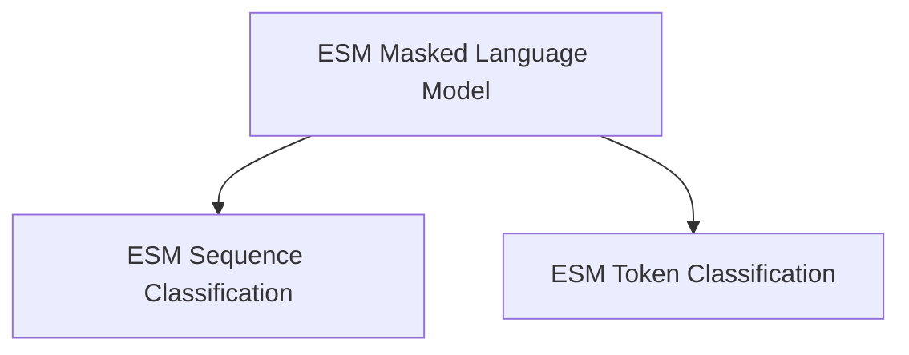

# ESM General Tasks Module Documentation

The `esm_general_tasks` module provides core functionalities for various downstream tasks using ESM (Evolutionary Scale Modeling) models. It encompasses implementations for masked language modeling, sequence classification, and token classification, enabling diverse applications in protein sequence analysis.

## Architecture Overview

The `esm_general_tasks` module is structured around three main sub-modules, each dedicated to a specific task. These sub-modules leverage the underlying ESM model architecture to perform their respective functions.

<!-- DIAGRAM_JSON
{
    "direction": "TD",
    "nodes": [
        {"id": "esm_masked_lm", "label": "ESM Masked Language Model", "type": "module", "link": "esm_masked_lm.md"},
        {"id": "esm_sequence_classification", "label": "ESM Sequence Classification", "type": "module", "link": "esm_sequence_classification.md"},
        {"id": "esm_token_classification", "label": "ESM Token Classification", "type": "module", "link": "esm_token_classification.md"}
    ],
    "edges": [
        {"source": "esm_masked_lm", "target": "esm_sequence_classification"},
        {"source": "esm_masked_lm", "target": "esm_token_classification"}
    ],
    "groups": []
}
-->

## Sub-modules

### [ESM Masked Language Model](esm_masked_lm.md)
This sub-module implements masked language modeling for ESM models, allowing for pre-training and understanding of protein sequences.

### [ESM Sequence Classification](esm_sequence_classification.md)
This sub-module handles sequence-level classification tasks using the ESM model, such as protein function prediction.

### [ESM Token Classification](esm_token_classification.md)
This sub-module performs token-level classification tasks with the ESM model, useful for tasks like identifying specific residues or domains.
