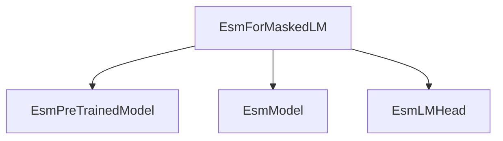

# esm_masked_lm

The `esm_masked_lm` module provides the `EsmForMaskedLM` class, which is designed for performing masked language modeling tasks using the Evolutionary Scale Modeling (ESM) architecture. This module is a specialized component within the larger ESM model family, focusing on the prediction of masked tokens in protein sequences.

## Architecture and Core Components

The `esm_masked_lm` module's primary component is the `EsmForMaskedLM` class. It builds upon the foundational `EsmModel` and incorporates an `EsmLMHead` for the language modeling specific operations.

### EsmForMaskedLM

- **Purpose**: This class is responsible for the overall masked language modeling functionality. It integrates the base ESM model with a prediction head to compute the likelihood of masked tokens.
- **Inheritance**: It inherits from `EsmPreTrainedModel`, providing common functionalities for ESM models, such as weight initialization and configuration handling.
- **Components**: Internally, it composes an `EsmModel` instance for extracting sequence representations and an `EsmLMHead` for generating prediction scores for masked tokens.
- **Functionality**: Its `forward` method processes input sequences, passes them through the `EsmModel`, and then uses the `EsmLMHead` to produce logits for each token. It can also compute the masked language modeling loss if labels are provided.
- **Contact Prediction**: It also exposes a `predict_contacts` method, delegating the call to the underlying `EsmModel`, which can be used to predict contacts in protein structures.

### Core Components:

- `src.transformers.models.esm.modeling_esm.EsmForMaskedLM`:
```python
class EsmForMaskedLM(EsmPreTrainedModel):
    _tied_weights_keys = {"lm_head.decoder.weight": "esm.embeddings.word_embeddings.weight"}

    def __init__(self, config):
        super().__init__(config)

        if config.is_decoder:
            logger.warning(
                "If you want to use `EsmForMaskedLM` make sure `config.is_decoder=False` for "
                "bi-directional self-attention."
            )

        self.esm = EsmModel(config, add_pooling_layer=False)
        self.lm_head = EsmLMHead(config)

        self.post_init()

    def get_output_embeddings(self):
        return self.lm_head.decoder

    def set_output_embeddings(self, new_embeddings):
        self.lm_head.decoder = new_embeddings

    @can_return_tuple
    @auto_docstring
    def forward(
        self,
        input_ids: torch.LongTensor | None = None,
        attention_mask: torch.Tensor | None = None,
        position_ids: torch.LongTensor | None = None,
        inputs_embeds: torch.FloatTensor | None = None,
        encoder_hidden_states: torch.FloatTensor | None = None,
        encoder_attention_mask: torch.Tensor | None = None,
        labels: torch.LongTensor | None = None,
        **kwargs: Unpack[TransformersKwargs],
    ) -> tuple | MaskedLMOutput:
        r"""
        labels (`torch.LongTensor` of shape `(batch_size, sequence_length)`, *optional*):
            Labels for computing the masked language modeling loss. Indices should be in `[-100, 0, ...,
            config.vocab_size]` (see `input_ids` docstring) Tokens with indices set to `-100` are ignored (masked), the
            loss is only computed for the tokens with labels in `[0, ..., config.vocab_size]`
        """

        outputs = self.esm(
            input_ids,
            attention_mask=attention_mask,
            position_ids=position_ids,
            inputs_embeds=inputs_embeds,
            encoder_hidden_states=encoder_hidden_states,
            encoder_attention_mask=encoder_attention_mask,
            **kwargs,
        )
        sequence_output = outputs[0]
        prediction_scores = self.lm_head(sequence_output)

        masked_lm_loss = None
        if labels is not None:
            loss_fct = CrossEntropyLoss()

            labels = labels.to(prediction_scores.device)
            masked_lm_loss = loss_fct(prediction_scores.view(-1, self.config.vocab_size), labels.view(-1))

        return MaskedLMOutput(
            loss=masked_lm_loss,
            logits=prediction_scores,
            hidden_states=outputs.hidden_states,
            attentions=outputs.attentions,
        )

    def predict_contacts(self, tokens, attention_mask):
        return self.esm.predict_contacts(tokens, attention_mask=attention_mask)
```

## Module Relationships

This module is part of the `esm_models` family and specifically addresses masked language modeling tasks. It relies on shared components like `EsmModel` and `EsmLMHead` defined within the broader ESM modeling utilities.

<!-- DIAGRAM_JSON
{
    "direction": "TD",
    "nodes": [
        {"id": "esm_masked_lm", "label": "EsmForMaskedLM", "type": "component", "link": null},
        {"id": "esm_pretrained_model", "label": "EsmPreTrainedModel", "type": "external", "link": "esm_models.md"},
        {"id": "esm_model", "label": "EsmModel", "type": "external", "link": "esm_models.md"},
        {"id": "esm_lm_head", "label": "EsmLMHead", "type": "external", "link": "esm_models.md"}
    ],
    "edges": [
        {"source": "esm_masked_lm", "target": "esm_pretrained_model"},
        {"source": "esm_masked_lm", "target": "esm_model"},
        {"source": "esm_masked_lm", "target": "esm_lm_head"}
    ],
    "groups": []
}
-->

