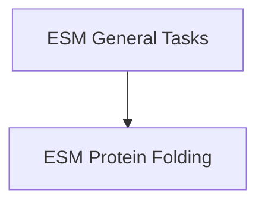

# ESM Models Module Documentation

The `esm_models` module provides implementations of various ESM (Evolutionary Scale Modeling) models for biological sequence analysis tasks. It includes models for general natural language processing tasks adapted for biological sequences, as well as specialized models for protein structure prediction.

## Architecture Overview

The `esm_models` module is composed of two main sub-modules, each addressing a distinct set of functionalities:

<!-- DIAGRAM_JSON
{
    "direction": "TD",
    "nodes": [
        {"id": "esm_general_tasks", "label": "ESM General Tasks", "type": "module", "link": "esm_general_tasks.md"},
        {"id": "esm_protein_folding", "label": "ESM Protein Folding", "type": "module", "link": "esm_protein_folding.md"}
    ],
    "edges": [
        {"source": "esm_general_tasks", "target": "esm_protein_folding"}
    ],
    "groups": []
}
-->

## Sub-modules

### [ESM General Tasks](esm_general_tasks.md)
This sub-module focuses on foundational biological sequence analysis tasks. It includes models for:
*   **Sequence Classification (`EsmForSequenceClassification`)**: Classifies entire protein sequences based on learned representations.
*   **Masked Language Modeling (`EsmForMaskedLM`)**: Predicts masked-out amino acids in a sequence, useful for learning contextual representations.
*   **Token Classification (`EsmForTokenClassification`)**: Assigns a label to each token (amino acid) in a sequence, suitable for tasks like secondary structure prediction or identifying functional regions.

### [ESM Protein Folding](esm_protein_folding.md)
This specialized sub-module provides capabilities for predicting protein 3D structures. It contains:
*   **Protein Folding (`EsmForProteinFolding`)**: Implements the ESMFold model, which predicts the 3D atomic coordinates of a protein from its amino acid sequence.

