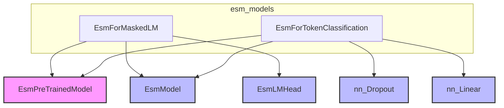

# esm_models
The `esm_models` module provides two specialized ESM models: `EsmForMaskedLM` for masked language modeling and `EsmForTokenClassification` for token-level prediction tasks. Both models extend `EsmPreTrainedModel` and utilize `EsmModel` as their backbone.

<!-- DIAGRAM_JSON
{
  "nodes": [
    {"id": "EsmForMaskedLM", "label": "EsmForMaskedLM"},
    {"id": "EsmForTokenClassification", "label": "EsmForTokenClassification"},
    {"id": "EsmPreTrainedModel", "label": "EsmPreTrainedModel", "metadata": {"type": "base_class"}},
    {"id": "EsmModel", "label": "EsmModel", "metadata": {"type": "component"}},
    {"id": "EsmLMHead", "label": "EsmLMHead", "metadata": {"type": "component"}},
    {"id": "nn_Dropout", "label": "nn.Dropout", "metadata": {"type": "component"}},
    {"id": "nn_Linear", "label": "nn.Linear", "metadata": {"type": "component"}}
  ],
  "edges": [
    {"source": "EsmForMaskedLM", "target": "EsmPreTrainedModel", "label": "inherits"},
    {"source": "EsmForTokenClassification", "target": "EsmPreTrainedModel", "label": "inherits"},
    {"source": "EsmForMaskedLM", "target": "EsmModel", "label": "uses"},
    {"source": "EsmForMaskedLM", "target": "EsmLMHead", "label": "uses"},
    {"source": "EsmForTokenClassification", "target": "EsmModel", "label": "uses"},
    {"source": "EsmForTokenClassification", "target": "nn_Dropout", "label": "uses"},
    {"source": "EsmForTokenClassification", "target": "nn_Linear", "label": "uses"}
  ],
  "groups": [
    {
      "id": "esm_models",
      "label": "esm_models",
      "nodes": ["EsmForMaskedLM", "EsmForTokenClassification"]
    }
  ]
}
-->
