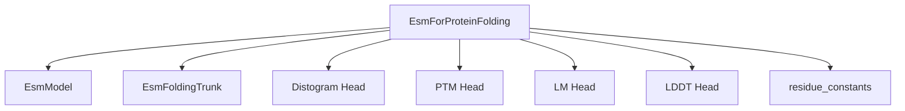

# esm_protein_folding

The `esm_protein_folding` module provides functionalities specifically designed for predicting the 3D structure of proteins, often referred to as protein folding. It leverages the robust language model capabilities of the broader ESM architecture to infer structural information from protein sequences.

## Architecture and Component Relationships

This module's core is the `EsmForProteinFolding` class, which orchestrates the entire protein folding process. It integrates several key components:

-   **`EsmModel`**: An external dependency (from the `esm_models` module) that provides powerful language model representations of protein sequences. These representations are crucial for capturing the underlying biochemical properties before structural prediction.
-   **`EsmFoldingTrunk`**: This is the primary internal component responsible for the iterative protein folding computations. It takes sequence and pairwise representations and refines them through multiple "recycles" to arrive at a predicted 3D structure.
-   **Prediction Heads**: The module includes specialized heads for various prediction tasks:
    -   **`Distogram Head`**: Predicts inter-residue distances (distograms), which are fundamental for defining the 3D structure.
    -   **`PTM Head`**: Predicts predicted TM-score (PTM) and aligned error (PAE), metrics for assessing the quality and alignment of predicted structures.
    -   **`LM Head`**: A language model head that can be used for masked language modeling objectives during training, ensuring the model maintains sequence-level understanding.
    -   **`LDDT Head`**: Predicts local distance difference test (pLDDT) scores, indicating the confidence of local structural predictions.
-   **`residue_constants`**: An external utility (from the `transformers` library, implicitly used) that provides constants and utility functions related to amino acid types and their properties, essential for handling protein sequences.

The `EsmForProteinFolding` class processes input protein sequences, first generating rich language model embeddings using `EsmModel`. These embeddings are then fed into the `EsmFoldingTrunk`, which iteratively refines the protein's structural coordinates. Finally, the various prediction heads operate on the trunk's outputs to provide detailed structural and quality assessments.

<!-- DIAGRAM_JSON
{
    "direction": "TD",
    "nodes": [
        {"id": "esm_for_protein_folding", "label": "EsmForProteinFolding", "type": "component", "link": null},
        {"id": "esm_model", "label": "EsmModel", "type": "external", "link": "esm_models.md"},
        {"id": "esm_folding_trunk", "label": "EsmFoldingTrunk", "type": "component", "link": null},
        {"id": "distogram_head", "label": "Distogram Head", "type": "component", "link": null},
        {"id": "ptm_head", "label": "PTM Head", "type": "component", "link": null},
        {"id": "lm_head", "label": "LM Head", "type": "component", "link": null},
        {"id": "lddt_head", "label": "LDDT Head", "type": "component", "link": null},
        {"id": "residue_constants", "label": "residue_constants", "type": "external", "link": null}
    ],
    "edges": [
        {"source": "esm_for_protein_folding", "target": "esm_model"},
        {"source": "esm_for_protein_folding", "target": "esm_folding_trunk"},
        {"source": "esm_for_protein_folding", "target": "distogram_head"},
        {"source": "esm_for_protein_folding", "target": "ptm_head"},
        {"source": "esm_for_protein_folding", "target": "lm_head"},
        {"source": "esm_for_protein_folding", "target": "lddt_head"},
        {"source": "esm_for_protein_folding", "target": "residue_constants"}
    ],
    "groups": []
}
-->

## How it Fits into the Overall System

The `esm_protein_folding` module is a specialized sub-module within the broader `esm_models` ecosystem. While `esm_models` encompasses a range of tasks such as masked language modeling, sequence classification, and token classification for protein sequences, `esm_protein_folding` specifically addresses the complex challenge of predicting 3D protein structures.

It leverages the foundational `EsmModel` (documented in [esm_models.md](esm_models.md)) to extract rich contextual embeddings from protein sequences. This tight integration means that advancements or improvements in the core `EsmModel` can directly benefit the `esm_protein_folding` capabilities. It represents a concrete application of the general-purpose ESM representations to a critical problem in structural biology, providing a complete pipeline from sequence to folded protein structure.