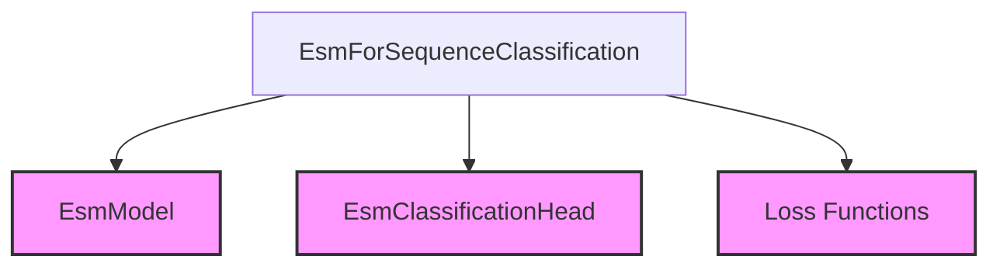

# ESM Sequence Classification Module

The `esm_sequence_classification` module provides the `EsmForSequenceClassification` class, a specialized model built upon the ESM (Evolutionary Scale Modeling) architecture for performing sequence classification tasks on biological sequences (e.g., protein sequences). It enables the classification of an entire input sequence into one of several predefined categories or for regression tasks.

## Core Functionality

The primary component of this module is `EsmForSequenceClassification`. This class extends `EsmPreTrainedModel` and encapsulates the necessary logic for sequence classification.

### `EsmForSequenceClassification`

- **Purpose**: To classify protein or other biological sequences. It leverages the powerful feature extraction capabilities of the `EsmModel` and applies a classification head for prediction.
- **Inputs**:
    - `input_ids`: Tokenized input sequences.
    - `attention_mask`: Mask to avoid performing attention on padding token indices.
    - `position_ids`: Positional embeddings (optional).
    - `inputs_embeds`: Directly pre-computed input embeddings (optional).
    - `labels`: Ground truth labels for computing the loss. Supports single-label classification, multi-label classification, and regression.
- **Outputs**: Returns a `SequenceClassifierOutput` object containing:
    - `loss`: The calculated loss based on the problem type (MSE, Cross-Entropy, or BCEWithLogits).
    - `logits`: The raw prediction scores before activation.
    - `hidden_states`: (Optional) Hidden states of the model.
    - `attentions`: (Optional) Attention weights.
- **Loss Calculation**: Automatically determines the problem type (regression, single-label, or multi-label classification) based on `num_labels` and `labels` data type, then applies the appropriate loss function (`MSELoss`, `CrossEntropyLoss`, or `BCEWithLogitsLoss`).

## Architecture and Component Relationships

The `esm_sequence_classification` module, specifically the `EsmForSequenceClassification` class, integrates several key components from the broader [esm_models](esm_models.md) family to perform its function.

- **`EsmModel`**: This is the backbone encoder model responsible for extracting contextualized representations from the input sequences. `EsmForSequenceClassification` uses the output of this model as input to its classification head.
- **`EsmClassificationHead`**: A dense layer (or a series of layers) that takes the pooled output from the `EsmModel` and projects it to the dimension corresponding to the number of classification labels.
- **Loss Functions**: Standard PyTorch loss functions (`MSELoss`, `CrossEntropyLoss`, `BCEWithLogitsLoss`) are dynamically chosen based on the task type (regression, single-label, or multi-label classification).

<!-- DIAGRAM_JSON
{
    "direction": "TD",
    "nodes": [
        {"id": "esm_seq_classification", "label": "EsmForSequenceClassification", "type": "component", "link": null},
        {"id": "esm_model", "label": "EsmModel", "type": "external", "link": "esm_models.md"},
        {"id": "esm_classification_head", "label": "EsmClassificationHead", "type": "external", "link": "esm_models.md"},
        {"id": "loss_functions", "label": "Loss Functions", "type": "external", "link": null}
    ],
    "edges": [
        {"source": "esm_seq_classification", "target": "esm_model"},
        {"source": "esm_seq_classification", "target": "esm_classification_head"},
        {"source": "esm_seq_classification", "target": "loss_functions"}
    ],
    "groups": []
}
-->

## Integration with the Overall System

The `esm_sequence_classification` module is a part of the broader [esm_general_tasks](esm_general_tasks.md) submodule, which in turn belongs to the [esm_models](esm_models.md) module within the `transformers` library. It provides a ready-to-use solution for sequence classification problems using ESM models, allowing developers to easily integrate protein sequence classification capabilities into their applications. Its modular design ensures reusability of the `EsmModel` backbone across various tasks like masked language modeling and token classification, documented in [esm_masked_lm](esm_masked_lm.md) and [esm_token_classification](esm_token_classification.md) respectively.

