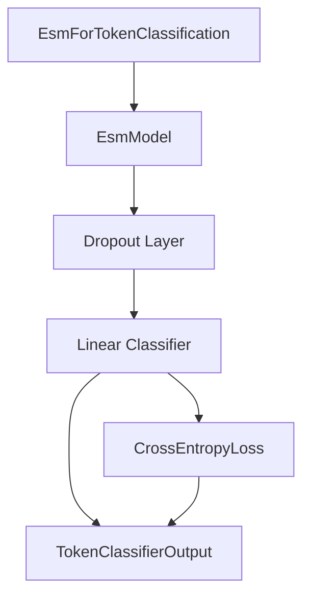

# esm_token_classification Module Documentation

## Introduction

The `esm_token_classification` module provides the necessary components for performing token classification tasks using ESM (Evolutionary Scale Modeling) models. This module is specifically designed to leverage the powerful representations learned by ESM models for sequence labeling problems, such as protein contact prediction or secondary structure prediction.

## Core Functionality

The primary component of this module is `EsmForTokenClassification`. This class extends `EsmPreTrainedModel` and integrates an `EsmModel` with a token classification head.

### EsmForTokenClassification

The `EsmForTokenClassification` class is responsible for taking the output of an ESM backbone model and transforming it into token-level predictions.

**Key Features:**

*   **Initialization**: It initializes with an `EsmModel` (from the `esm_models` module), a dropout layer, and a linear classifier layer. The number of labels for classification is configured during initialization.
*   **Forward Pass**:
    *   It first passes the input through the internal `EsmModel` to obtain sequence representations.
    *   A dropout layer is applied to the `sequence_output` from the ESM model for regularization.
    *   Finally, a linear classifier maps the hidden states to the `num_labels` for token-level predictions (logits).
    *   If `labels` are provided, it calculates the token classification loss using `CrossEntropyLoss`.
*   **Output**: Returns a `TokenClassifierOutput` object containing the computed loss (if labels are provided), logits, hidden states, and attentions.

**Component:** `src.transformers.models.esm.modeling_esm.EsmForTokenClassification`

```python
class EsmForTokenClassification(EsmPreTrainedModel):
    def __init__(self, config):
        super().__init__(config)
        self.num_labels = config.num_labels

        self.esm = EsmModel(config, add_pooling_layer=False)
        self.dropout = nn.Dropout(config.hidden_dropout_prob)
        self.classifier = nn.Linear(config.hidden_size, config.num_labels)

        self.post_init()

    @can_return_tuple
    @auto_docstring
    def forward(
        self,
        input_ids: torch.LongTensor | None = None,
        attention_mask: torch.Tensor | None = None,
        position_ids: torch.LongTensor | None = None,
        inputs_embeds: torch.FloatTensor | None = None,
        labels: torch.LongTensor | None = None,
        **kwargs: Unpack[TransformersKwargs],
    ) -> tuple | TokenClassifierOutput:
        r"""
        labels (`torch.LongTensor` of shape `(batch_size, sequence_length)`, *optional*):
            Labels for computing the token classification loss. Indices should be in `[0, ..., config.num_labels - 1]`.
        """

        outputs = self.esm(
            input_ids,
            attention_mask=attention_mask,
            position_ids=position_ids,
            inputs_embeds=inputs_embeds,
            **kwargs,
        )

        sequence_output = outputs[0]

        sequence_output = self.dropout(sequence_output)
        logits = self.classifier(sequence_output)

        loss = None
        if labels is not None:
            loss_fct = CrossEntropyLoss()

            labels = labels.to(logits.device)
            loss = loss_fct(logits.view(-1, self.num_labels), labels.view(-1))

        return TokenClassifierOutput(
            loss=loss,
            logits=logits,
            hidden_states=outputs.hidden_states,
            attentions=outputs.attentions,
        )
```

## Architecture and Component Relationships

The `esm_token_classification` module is a leaf module within the broader `esm_general_tasks` and `esm_models` hierarchy. It depends on the core `EsmModel` for its base embeddings and representations.

<!-- DIAGRAM_JSON
{
    "direction": "TD",
    "nodes": [
        {"id": "esm_for_token_classification", "label": "EsmForTokenClassification", "type": "component", "link": null},
        {"id": "esm_model", "label": "EsmModel", "type": "external", "link": "esm_models.md"},
        {"id": "dropout_layer", "label": "Dropout Layer", "type": "component", "link": null},
        {"id": "linear_classifier", "label": "Linear Classifier", "type": "component", "link": null},
        {"id": "cross_entropy_loss", "label": "CrossEntropyLoss", "type": "component", "link": null},
        {"id": "token_classifier_output", "label": "TokenClassifierOutput", "type": "component", "link": null}
    ],
    "edges": [
        {"source": "esm_for_token_classification", "target": "esm_model"},
        {"source": "esm_model", "target": "dropout_layer"},
        {"source": "dropout_layer", "target": "linear_classifier"},
        {"source": "linear_classifier", "target": "token_classifier_output"},
        {"source": "linear_classifier", "target": "cross_entropy_loss"},
        {"source": "cross_entropy_loss", "target": "token_classifier_output"}
    ],
    "groups": []
}
-->


## How the Module Fits into the Overall System

The `esm_token_classification` module is a specialized component within the larger [esm_models](esm_models.md) family. It provides a ready-to-use solution for token-level prediction tasks on biological sequences, often used in bioinformatics for tasks like protein structure prediction, active site identification, or residue-level property prediction. It relies on the robust sequence representations generated by the core `EsmModel` and integrates seamlessly with other ESM-related functionalities for various downstream applications, such as [esm_sequence_classification](esm_sequence_classification.md) and [esm_masked_lm](esm_masked_lm.md).
