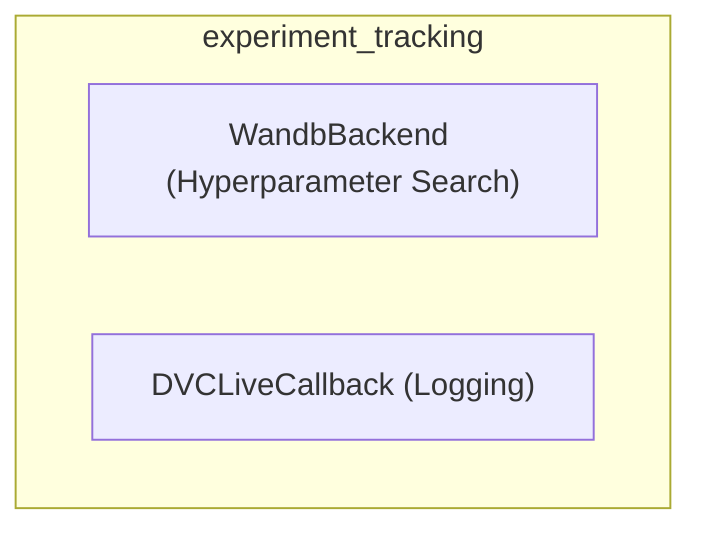

# experiment_tracking
This module provides components for integrating experiment tracking and hyperparameter search functionalities, including a Weights & Biases backend and a DVCLive logging callback.

<!-- DIAGRAM_JSON
{
  "nodes": [
    {
      "id": "WandbBackend",
      "label": "WandbBackend (Hyperparameter Search)"
    },
    {
      "id": "DVCLiveCallback",
      "label": "DVCLiveCallback (Logging)"
    }
  ],
  "edges": [],
  "groups": [
    {
      "id": "experiment_tracking",
      "label": "experiment_tracking",
      "nodes": ["WandbBackend", "DVCLiveCallback"]
    }
  ]
}
-->
