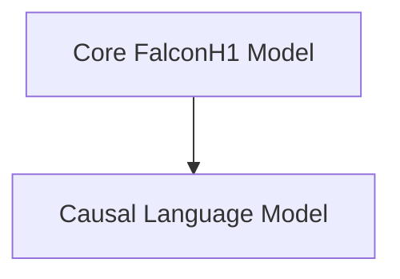

# FalconH1 Models Documentation

## Introduction

The `falcon_h1_models` module provides the core components for implementing and utilizing the FalconH1 language model architecture. It includes the foundational model structure and the causal language model head for text generation tasks.

## Architecture Overview

The FalconH1 model architecture is composed of a core model responsible for token embeddings and layer processing, and a causal language model head built on top for generative capabilities.

<!-- DIAGRAM_JSON
{
    "direction": "TD",
    "nodes": [
        {"id": "core_model", "label": "Core FalconH1 Model", "type": "module", "link": "core_model.md"},
        {"id": "causal_lm", "label": "Causal Language Model", "type": "module", "link": "causal_lm.md"}
    ],
    "edges": [
        {"source": "core_model", "target": "causal_lm"}
    ],
    "groups": []
}
-->

## Sub-modules

### [Core FalconH1 Model](core_model.md)
This sub-module defines the fundamental architecture of the FalconH1 model, including embedding, decoder layers, and normalization. It provides the base for various tasks.

### [Causal Language Model](causal_lm.md)
This sub-module implements the FalconH1 model for causal language modeling, allowing for text generation and sequence prediction. It extends the core model with a language modeling head.
