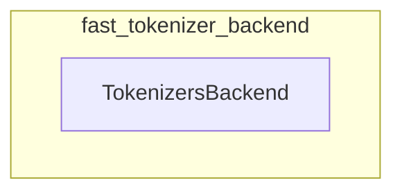

# fast_tokenizer_backend
This module defines `TokenizersBackend`, a foundational class for fast tokenizers, providing common functionalities for tokenization, special token handling, and vocabulary management by wrapping the HuggingFace `tokenizers` library.

<!-- DIAGRAM_JSON
{
    "nodes": [
        {
            "id": "fast_tokenizer_backend",
            "label": "fast_tokenizer_backend",
            "type": "module"
        },
        {
            "id": "TokenizersBackend",
            "label": "TokenizersBackend",
            "type": "class"
        }
    ],
    "edges": [
        {
            "source": "fast_tokenizer_backend",
            "target": "TokenizersBackend",
            "type": "contains"
        }
    ],
    "groups": [
        {
            "id": "fast_tokenizer_backend_group",
            "label": "fast_tokenizer_backend",
            "nodes": [
                "TokenizersBackend"
            ]
        }
    ]
}
-->
