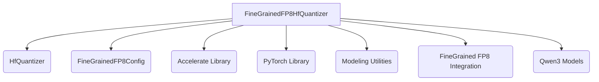

# Fine-Grained FP8 Quantizer Module Documentation

## Introduction

The `fine_grained_fp8_quantizer` module provides a specialized implementation for FP8 quantization within the Transformers library. It is designed to quantize models, including those with Mixture-of-Experts (MoE) architectures, using FP8 formats like `e4m3fn`. This module plays a crucial role in enabling efficient inference with reduced memory footprint and faster computation on compatible hardware.

## Core Functionality

The primary component of this module is `FineGrainedFP8HfQuantizer`, which extends the base `HfQuantizer` to handle FP8 specific quantization logic.

### `FineGrainedFP8HfQuantizer`

-   **Purpose:** Implements the fine-grained FP8 quantization scheme for both standard and MoE models.
-   **Environment Validation:** Before quantization, it checks for the availability of `accelerate` and compatible GPU/XPU hardware (compute capability >= 8.9 for NVIDIA GPUs). If requirements are not met or `dequantize` is enabled, it defaults to dequantizing the model to `bf16`.
-   **Parameter Quantization:** Determines which parameters in a `PreTrainedModel` should be quantized, specifically targeting `FP8Linear` and `FP8Experts` modules while allowing biases to remain unquantized or handling pre-quantized weights.
-   **Memory Footprint:** Reports the element size of quantized parameters as 1 byte, reflecting the 8-bit quantization.
-   **Model Processing:** Before weights are loaded, it replaces standard linear layers with FP8-compatible linear layers (`FP8Linear`) and `FP8Experts`, excluding specified modules to keep them in full precision.
-   **Tensor Parallelism:** Integrates with tensor parallelism by defining a `base_model_tp_plan` for specific model architectures (e.g., `Qwen3`) to correctly distribute quantized weights and scales across devices.
-   **Serialization & Trainability:** The quantizer itself is serializable but not trainable, meaning it's primarily for inference-time optimization.
-   **Quantization Operations:** Provides `Fp8Quantize` for applying FP8 quantization and `Fp8Dequantize` for converting FP8 weights back to higher precision if `dequantize` is enabled and the model is pre-quantized.

## Architecture and Component Relationships

The `fine_grained_fp8_quantizer` module is a sub-module of `fp_based_quantizers`, which in turn is a sub-module of the main `quantizers` module. It interacts with several external components to perform its tasks.

<!-- DIAGRAM_JSON
{
    "direction": "TD",
    "nodes": [
        {"id": "fine_grained_fp8_hf_quantizer", "label": "FineGrainedFP8HfQuantizer", "type": "component", "link": null},
        {"id": "hf_quantizer", "label": "HfQuantizer", "type": "external", "link": "quantizers.md"},
        {"id": "fine_grained_fp8_config", "label": "FineGrainedFP8Config", "type": "external", "link": null},
        {"id": "accelerate", "label": "Accelerate Library", "type": "external", "link": null},
        {"id": "torch", "label": "PyTorch Library", "type": "external", "link": null},
        {"id": "modeling_utilities", "label": "Modeling Utilities", "type": "external", "link": "modeling_utilities.md"},
        {"id": "finegrained_fp8_integration", "label": "FineGrained FP8 Integration", "type": "external", "link": "integrations.md"},
        {"id": "qwen3_models", "label": "Qwen3 Models", "type": "external", "link": "qwen3_5_models.md"}
    ],
    "edges": [
        {"source": "fine_grained_fp8_hf_quantizer", "target": "hf_quantizer"},
        {"source": "fine_grained_fp8_hf_quantizer", "target": "fine_grained_fp8_config"},
        {"source": "fine_grained_fp8_hf_quantizer", "target": "accelerate"},
        {"source": "fine_grained_fp8_hf_quantizer", "target": "torch"},
        {"source": "fine_grained_fp8_hf_quantizer", "target": "modeling_utilities"},
        {"source": "fine_grained_fp8_hf_quantizer", "target": "finegrained_fp8_integration"},
        {"source": "fine_grained_fp8_hf_quantizer", "target": "qwen3_models"}
    ],
    "groups": []
}
-->

## Integration with the Overall System

This `fine_grained_fp8_quantizer` module is a specific quantization strategy within the broader [quantizers](quantizers.md) ecosystem of the Transformers library. It is designed to work seamlessly with the model loading mechanism, allowing models to be loaded and immediately prepared for FP8 inference. Its validation checks ensure that FP8 quantization is only applied when the environment supports it, gracefully falling back to dequantization otherwise. The integration with tensor parallelism through `update_tp_plan` ensures correct behavior in distributed inference setups, particularly for models like those in [qwen3_5_models](qwen3_5_models.md) that might leverage such parallelism. The module leverages components from the [integrations](integrations.md) module for the underlying FP8 linear layer implementations and core model loading utilities from [modeling_utilities](modeling_utilities.md) for model manipulation and parameter handling.
