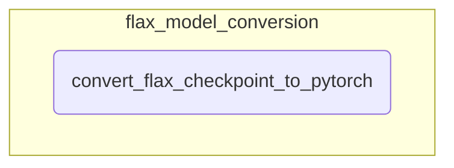

# flax_model_conversion
This module facilitates the conversion of Flax model checkpoints, particularly for Switch Transformers, into their PyTorch equivalent for broader compatibility.

<!-- DIAGRAM_JSON
{
    "nodes": [
        {
            "id": "flax_model_conversion",
            "label": "flax_model_conversion",
            "type": "module"
        },
        {
            "id": "convert_flax_checkpoint_to_pytorch",
            "label": "convert_flax_checkpoint_to_pytorch",
            "type": "function"
        }
    ],
    "edges": [
        {
            "source": "flax_model_conversion",
            "target": "convert_flax_checkpoint_to_pytorch",
            "type": "contains"
        }
    ],
    "groups": [
        {
            "id": "flax_model_conversion_group",
            "label": "flax_model_conversion",
            "nodes": [
                "convert_flax_checkpoint_to_pytorch"
            ]
        }
    ]
}
-->
