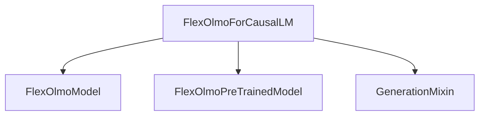

# flex_olmo_models

## Introduction

The `flex_olmo_models` module provides the implementation for the FlexOlmo causal language model within the Transformers framework. It is designed to facilitate text generation tasks and incorporates advanced features such as Mixture-of-Experts (MoE) with a router auxiliary loss for efficient and scalable language modeling.

## Core Functionality

The primary component of this module is `FlexOlmoForCausalLM`.

### `FlexOlmoForCausalLM`

-   **Purpose**: `FlexOlmoForCausalLM` is a causal language model built on the FlexOlmo architecture. It is responsible for generating text sequences by predicting the next token in a given sequence.
-   **Inheritance**: It inherits from `FlexOlmoPreTrainedModel` (a base class for FlexOlmo models) and `GenerationMixin` from the [generation_mixins module](generation_mixins.md), which provides common text generation utilities.
-   **Mixture-of-Experts (MoE) Support**: The model integrates a Mixture-of-Experts architecture, allowing it to dynamically route tokens to different expert networks. This is managed through `num_experts` and `num_experts_per_tok` configurations. It also includes a `router_aux_loss_coef` for applying a load-balancing loss to the router logits, ensuring experts are utilized efficiently.
-   **Architecture**: Internally, it utilizes `FlexOlmoModel` for its core transformer layers, and a linear layer (`lm_head`) to project the hidden states to the vocabulary size for token prediction.
-   **Parallelization and Weight Tying**: The model defines `_tied_weights_keys`, `_tp_plan`, and `_pp_plan` for handling weight tying and various parallelization strategies (e.g., tensor parallelism, pipeline parallelism) to optimize performance and memory usage in distributed training and inference environments.

## Architecture and Component Relationships

The `flex_olmo_models` module is structured around the `FlexOlmoForCausalLM` class, which leverages other internal FlexOlmo components and integrates with external utilities for generation capabilities.

<!-- DIAGRAM_JSON
{
    "direction": "TD",
    "nodes": [
        {"id": "flex_olmo_for_causal_lm", "label": "FlexOlmoForCausalLM", "type": "component", "link": null},
        {"id": "flex_olmo_model", "label": "FlexOlmoModel", "type": "component", "link": null},
        {"id": "flex_olmo_pretrained_model", "label": "FlexOlmoPreTrainedModel", "type": "component", "link": null},
        {"id": "generation_mixins", "label": "GenerationMixin", "type": "external", "link": "generation_mixins.md"}
    ],
    "edges": [
        {"source": "flex_olmo_for_causal_lm", "target": "flex_olmo_model"},
        {"source": "flex_olmo_for_causal_lm", "target": "flex_olmo_pretrained_model"},
        {"source": "flex_olmo_for_causal_lm", "target": "generation_mixins"}
    ],
    "groups": []
}
-->


**Explanation of Diagram:**

-   `FlexOlmoForCausalLM`: This is the main class in the `flex_olmo_models` module. It orchestrates the causal language modeling process.
-   `FlexOlmoModel`: Represents the underlying FlexOlmo transformer architecture that `FlexOlmoForCausalLM` utilizes for processing inputs and generating hidden states.
-   `FlexOlmoPreTrainedModel`: A base class providing common functionalities for all FlexOlmo models, from which `FlexOlmoForCausalLM` inherits.
-   `GenerationMixin`: An external utility from the `generation_mixins` module that `FlexOlmoForCausalLM` inherits from, enabling standard text generation methods like `generate`.

## How the Module Fits into the Overall System

The `flex_olmo_models` module provides a specialized causal language model for the Transformers ecosystem. It can be integrated into larger applications requiring text generation, especially those that benefit from the Mixture-of-Experts architecture for improved performance and efficiency. Its adherence to the `GenerationMixin` interface ensures compatibility with the broader Transformers generation pipeline.

## Usage Example

Here's an example demonstrating how to use `FlexOlmoForCausalLM` for text generation:

```python
>>> from transformers import AutoTokenizer, FlexOlmoForCausalLM

>>> model = FlexOlmoForCausalLM.from_pretrained("allenai/FlexOlmo-1B-7B-0924")
>>> tokenizer = AutoTokenizer.from_pretrained("allenai/FlexOlmo-1B-7B-0924")

>>> prompt = "Hey, are you conscious? Can you talk to me?"
>>> inputs = tokenizer(prompt, return_tensors="pt")

>>> # Generate
>>> generate_ids = model.generate(inputs.input_ids, max_length=30)
>>> tokenizer.batch_decode(generate_ids, skip_special_tokens=True, clean_up_tokenization_spaces=False)[0]
'Hey, are you conscious? Can you talk to me?
I’m not sure if you’re conscious of this, but I’m'
```