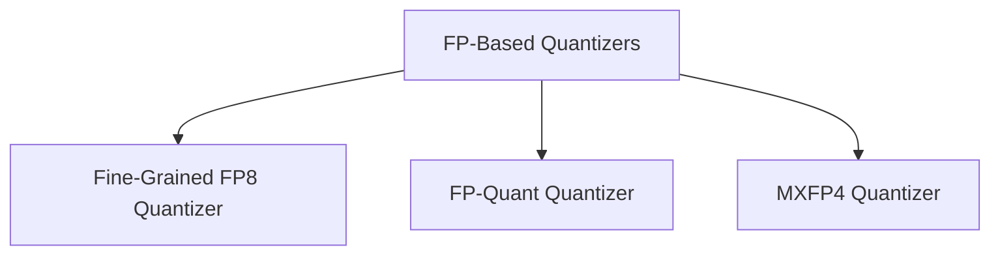

# FP-Based Quantizers Module Documentation

## Introduction

The `fp_based_quantizers` module provides implementations for various floating-point-based quantization methods within the `transformers` library. These quantizers enable efficient model inference by reducing the precision of model weights and activations, supporting both pre-quantized models and on-the-fly quantization.

## Architecture Overview

The `fp_based_quantizers` module is composed of several sub-modules, each dedicated to a specific floating-point quantization technique. These sub-modules encapsulate the logic for validating the environment, processing models before and after weight loading, and handling quantization-specific operations.

<!-- DIAGRAM_JSON
{
    "direction": "TD",
    "nodes": [
        {"id": "fine_grained_fp8_quantizer", "label": "Fine-Grained FP8 Quantizer", "type": "module", "link": "fine_grained_fp8_quantizer.md"},
        {"id": "fp_quant_quantizer", "label": "FP-Quant Quantizer", "type": "module", "link": "fp_quant_quantizer.md"},
        {"id": "mxfp4_quantizer", "label": "MXFP4 Quantizer", "type": "module", "link": "mxfp4_quantizer.md"}
    ],
    "edges": [
        {"source": "fp_based_quantizers", "target": "fine_grained_fp8_quantizer"},
        {"source": "fp_based_quantizers", "target": "fp_quant_quantizer"},
        {"source": "fp_based_quantizers", "target": "mxfp4_quantizer"}
    ],
    "groups": []
}
-->

## Sub-modules

### [Fine-Grained FP8 Quantizer](fine_grained_fp8_quantizer.md)

This sub-module implements FP8 quantization, designed to work with both standard and Mixture-of-Experts (MoE) models. It supports e4m3fn formats based on the platform and includes environment validation to ensure compatibility with acceleration libraries and GPU capabilities. It handles the replacement of linear layers with FP8-specific ones and manages weight conversions.

### [FP-Quant Quantizer](fp_quant_quantizer.md)

The `FP-Quant Quantizer` is responsible for applying the FP-Quant method. It supports loading pre-quantized models and performing in-flight quantization of full-precision models. This quantizer is primarily supported on GPU or Intel XPU and relies on the `qutlass` and `fp_quant` libraries for real quantization, with an option for Triton-based pseudo-quantization.

### [MXFP4 Quantizer](mxfp4_quantizer.md)

This sub-module provides FP4 quantization using FBGEMM kernels. It requires specific hardware (GPUs with compute capability >= 7.5 or XPUs) and the Triton and `kernels` packages. It includes extensive environment validation and handles model processing before and after weight loading, including cache cleaning for Triton operations.