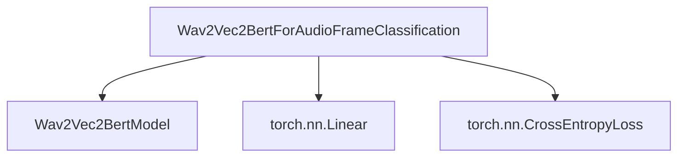

# frame_classification Module Documentation

## Introduction

The `frame_classification` module provides a specialized model for audio frame classification, leveraging the Wav2Vec2-BERT architecture. It is designed to classify individual frames within an audio sequence, making it suitable for tasks requiring fine-grained temporal analysis of audio.

## Purpose and Core Functionality

This module's primary purpose is to enable audio frame classification using a pre-trained Wav2Vec2-BERT model. Its core functionality includes:

*   **Audio Frame Classification**: Classifies each frame of an input audio sequence into one of several predefined categories.
*   **Wav2Vec2-BERT Integration**: Utilizes the robust feature extraction capabilities of the Wav2Vec2-BERT model as its backbone.
*   **Configurable Layer Summation**: Supports weighted summation of hidden states from multiple transformer layers for enhanced feature representation.
*   **Base Model Freezing**: Provides a mechanism to freeze the base Wav2Vec2-BERT model's parameters, allowing for efficient fine-tuning of only the classification head.
*   **Loss Computation**: Automatically computes the cross-entropy loss during training when labels are provided.

## Architecture and Component Relationships

The `frame_classification` module is centered around the `Wav2Vec2BertForAudioFrameClassification` class, which orchestrates the audio processing and classification. It interacts with the core `Wav2Vec2BertModel` for feature extraction and standard PyTorch components for classification and loss calculation.

<!-- DIAGRAM_JSON
{
    "direction": "TD",
    "nodes": [
        {"id": "Wav2Vec2BertForAudioFrameClassification", "label": "Wav2Vec2BertForAudioFrameClassification", "type": "component", "link": null},
        {"id": "Wav2Vec2BertModel", "label": "Wav2Vec2BertModel", "type": "external", "link": "wav2vec2_bert_models.md"},
        {"id": "nn.Linear", "label": "torch.nn.Linear", "type": "external", "link": null},
        {"id": "CrossEntropyLoss", "label": "torch.nn.CrossEntropyLoss", "type": "external", "link": null}
    ],
    "edges": [
        {"source": "Wav2Vec2BertForAudioFrameClassification", "target": "Wav2Vec2BertModel"},
        {"source": "Wav2Vec2BertForAudioFrameClassification", "target": "nn.Linear"},
        {"source": "Wav2Vec2BertForAudioFrameClassification", "target": "CrossEntropyLoss"}
    ],
    "groups": []
}
-->



### Component Details

#### Wav2Vec2BertForAudioFrameClassification

`Wav2Vec2BertForAudioFrameClassification` is the main class within this module, extending `Wav2Vec2BertPreTrainedModel`. It orchestrates the entire frame classification process.

**Initialization (`__init__`)**

```python
class Wav2Vec2BertForAudioFrameClassification(Wav2Vec2BertPreTrainedModel):
    def __init__(self, config):
        super().__init__(config)

        if hasattr(config, "add_adapter") and config.add_adapter:
            raise ValueError(
                "Audio frame classification does not support the use of Wav2Vec2Bert adapters (config.add_adapter=True)"
            )
        self.wav2vec2_bert = Wav2Vec2BertModel(config)
        num_layers = config.num_hidden_layers + 1  # transformer layers + input embeddings
        if config.use_weighted_layer_sum:
            self.layer_weights = nn.Parameter(torch.ones(num_layers) / num_layers)
        self.classifier = nn.Linear(config.hidden_size, config.num_labels)
        self.num_labels = config.num_labels

        self.post_init()
```

*   Initializes the base `Wav2Vec2BertModel`.
*   Sets up a linear classifier (`nn.Linear`) for the output.
*   Optionally initializes `layer_weights` for weighted hidden state summation if `config.use_weighted_layer_sum` is `True`.
*   Raises a `ValueError` if adapters are enabled, as they are not supported for this task.

**`freeze_base_model` Method**

```python
    def freeze_base_model(self):
        """
        Calling this function will disable the gradient computation for the base model so that its parameters will not
        be updated during training. Only the classification head will be updated.
        """
        for param in self.wav2vec2_bert.parameters():
            param.requires_grad = False
```

*   Disables gradient computation for the `wav2vec2_bert` base model, effectively freezing its parameters.
*   Useful for fine-tuning scenarios where only the newly added classification head needs to be trained.

**`forward` Method**

```python
    @auto_docstring
    def forward(
        self,
        input_features: torch.Tensor | None,
        attention_mask: torch.Tensor | None = None,
        labels: torch.Tensor | None = None,
        output_attentions: bool | None = None,
        output_hidden_states: bool | None = None,
        return_dict: bool | None = None,
        **kwargs,
    ) -> tuple | TokenClassifierOutput:
        r"""
        labels (`torch.LongTensor` of shape `(batch_size,)`, *optional*):
            Labels for computing the sequence classification/regression loss. Indices should be in `[0, ...,
            config.num_labels - 1]`. If `config.num_labels == 1` a regression loss is computed (Mean-Square loss), If
            `config.num_labels > 1` a classification loss is computed (Cross-Entropy).
        """

        return_dict = return_dict if return_dict is not None else self.config.return_dict
        output_hidden_states = True if self.config.use_weighted_layer_sum else output_hidden_states

        outputs = self.wav2vec2_bert(
            input_features,
            attention_mask=attention_mask,
            output_attentions=output_attentions,
            output_hidden_states=output_hidden_states,
            return_dict=return_dict,
        )

        if self.config.use_weighted_layer_sum:
            hidden_states = outputs[_HIDDEN_STATES_START_POSITION]
            hidden_states = torch.stack(hidden_states, dim=1)
            norm_weights = nn.functional.softmax(self.layer_weights, dim=-1)
            hidden_states = (hidden_states * norm_weights.view(-1, 1, 1)).sum(dim=1)
        else:
            hidden_states = outputs[0]

        logits = self.classifier(hidden_states)

        loss = None
        if labels is not None:
            loss_fct = CrossEntropyLoss()
            loss = loss_fct(logits.view(-1, self.num_labels), torch.argmax(labels.view(-1, self.num_labels), axis=1))

        if not return_dict:
            output = (logits,) + outputs[_HIDDEN_STATES_START_POSITION:]
            return output

        return TokenClassifierOutput(
            loss=loss,
            logits=logits,
            hidden_states=outputs.hidden_states,
            attentions=outputs.attentions,
        )
```

*   Takes `input_features`, `attention_mask`, and optional `labels` as input.
*   Passes the `input_features` through the `wav2vec2_bert` base model to obtain hidden states.
*   If `config.use_weighted_layer_sum` is `True`, it computes a weighted sum of the hidden states from all layers.
*   Applies the linear classifier to the resulting hidden states to produce `logits`.
*   If `labels` are provided, it computes the `CrossEntropyLoss`.
*   Returns either a tuple of outputs or a `TokenClassifierOutput` dataclass, depending on `return_dict`.

## External Dependencies

This module depends on the following external components:

*   [`wav2vec2_bert_models.md`](wav2vec2_bert_models.md): Provides the base `Wav2Vec2BertModel` for feature extraction.
*   `torch.nn.Linear`: A standard PyTorch module for the classification head.
*   `torch.nn.CrossEntropyLoss`: A standard PyTorch loss function used for computing the classification loss.
