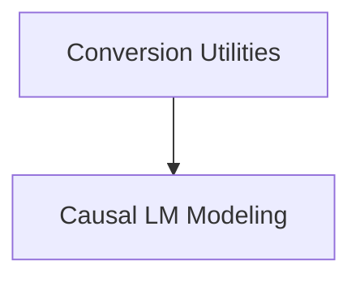

# Gemma2 Models Documentation

## Introduction
The `gemma2_models` module provides the core components for Google's Gemma2 large language model within the Hugging Face Transformers library. It includes utilities for converting pre-trained Gemma2 model weights to the Hugging Face format and the implementation of the Gemma2 Causal Language Model for various natural language processing tasks.

## Architecture Overview
The `gemma2_models` module is structured into two main sub-modules:
- **Conversion Utilities**: Responsible for adapting Gemma2 checkpoints for use with Hugging Face.
- **Causal LM Modeling**: Contains the primary model architecture for causal language modeling with Gemma2.

These modules work together to enable seamless integration and utilization of Gemma2 models.

<!-- DIAGRAM_JSON
{
    "direction": "TD",
    "nodes": [
        {"id": "conversion_utilities", "label": "Conversion Utilities", "type": "module", "link": "conversion_utilities.md"},
        {"id": "causal_lm_modeling", "label": "Causal LM Modeling", "type": "module", "link": "causal_lm_modeling.md"}
    ],
    "edges": [
        {"source": "conversion_utilities", "target": "causal_lm_modeling"}
    ],
    "groups": []
}
-->

## Sub-modules:

### [Conversion Utilities](conversion_utilities.md)
This sub-module focuses on the essential scripts and functions required to convert Gemma2 model weights from their original format to be compatible with the Hugging Face Transformers library. This ensures that pre-trained Gemma2 models can be easily loaded and used within the Hugging Face ecosystem.

### [Causal LM Modeling](causal_lm_modeling.md)
This sub-module contains the core implementation of the Gemma2 Causal Language Model. It defines the model architecture, forward pass logic, and provides functionalities for tasks such as text generation. It also integrates with Hugging Face's `GenerationMixin` for enhanced generation capabilities.
