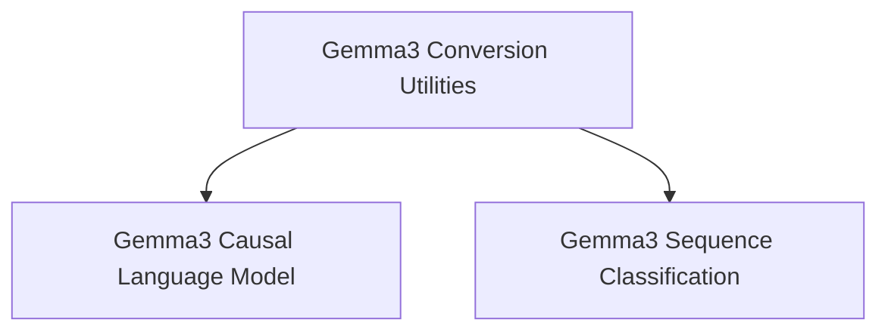

# Gemma3 Models Documentation

## Introduction

The `gemma3_models` module provides the core components for working with Gemma 3 models, including utilities for converting model weights and implementations for causal language modeling and sequence classification tasks. This module serves as the entry point for utilizing Gemma 3 within the Hugging Face Transformers ecosystem.

## Architecture Overview

The `gemma3_models` module is structured into several sub-modules, each handling specific functionalities. The architecture is designed to separate concerns between model conversion, causal language modeling, and sequence classification. The following diagram illustrates the relationships between these components:

<!-- DIAGRAM_JSON
{
    "direction": "TD",
    "nodes": [
        {"id": "gemma3_conversion_utilities", "label": "Gemma3 Conversion Utilities", "type": "module", "link": "gemma3_conversion_utilities.md"},
        {"id": "gemma3_causal_lm", "label": "Gemma3 Causal Language Model", "type": "module", "link": "gemma3_causal_lm.md"},
        {"id": "gemma3_sequence_classification", "label": "Gemma3 Sequence Classification", "type": "module", "link": "gemma3_sequence_classification.md"}
    ],
    "edges": [
        {"source": "gemma3_conversion_utilities", "target": "gemma3_causal_lm"},
        {"source": "gemma3_conversion_utilities", "target": "gemma3_sequence_classification"}
    ],
    "groups": []
}
-->

## Sub-modules

### [Gemma3 Conversion Utilities](gemma3_conversion_utilities.md)
This sub-module is responsible for converting Gemma 3 model weights and tokenizer configurations from their original Orbax format to the Hugging Face Transformers format. It ensures compatibility and ease of use within the Hugging Face ecosystem.

### [Gemma3 Causal Language Model](gemma3_causal_lm.md)
This sub-module provides the implementation of the Gemma 3 model specifically tailored for causal language modeling tasks. It includes the `Gemma3ForCausalLM` class, which is used for text generation and other sequence-to-sequence prediction scenarios.

### [Gemma3 Sequence Classification](gemma3_sequence_classification.md)
This sub-module offers the Gemma 3 model configured for sequence classification tasks. It includes the `Gemma3ForSequenceClassification` class, which can be utilized for tasks like sentiment analysis, topic classification, and other single-sequence classification problems.
