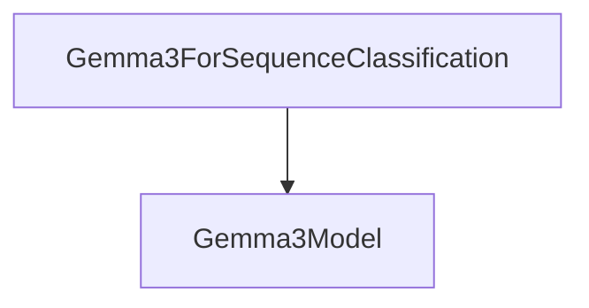

# Module: `gemma3_sequence_classification`

## Introduction

This module provides the `Gemma3ForSequenceClassification` model, a specialized Gemma3 model designed for sequence classification tasks. It extends the base `Gemma3PreTrainedModel` and leverages the `Gemma3Model` to process input sequences and predict a class label. This module is an integral part of the broader Gemma3 model family, focusing on discriminative tasks such as sentiment analysis or topic classification.

## Core Functionality

The `gemma3_sequence_classification` module primarily offers the `Gemma3ForSequenceClassification` class, which performs the following:

-   **Sequence Classification**: Takes input sequences (e.g., text) and classifies them into one of several predefined categories.
-   **Loss Calculation**: Computes the appropriate loss (Mean-Square Loss for regression or Cross-Entropy Loss for classification) based on the number of labels configured.
-   **Padding Token Handling**: Intelligently handles padding tokens to correctly pool the logits for sequence-level classification, supporting both left and right padding.

### `Gemma3ForSequenceClassification`

-   **Purpose**: A PyTorch module that adapts the Gemma3 model for sequence classification by adding a linear classification head on top of the base model's output.
-   **Key Methods**:
    -   `__init__(self, config)`: Initializes the classification head and the underlying `Gemma3Model` based on the provided configuration.
    -   `forward(...)`: Processes input `input_ids`, `pixel_values`, `attention_mask`, etc., through the `Gemma3Model`, extracts the `last_hidden_state`, and then passes it through a linear layer (`self.score`) to produce `logits`. It then pools these logits and, if `labels` are provided, computes the classification loss.

## Architecture and Component Relationships

This module is a leaf module within the `gemma3_models` family, focusing on a specific application of the Gemma3 architecture. Its primary component, `Gemma3ForSequenceClassification`, builds upon the core `Gemma3Model`.

<!-- DIAGRAM_JSON
{
    "direction": "TD",
    "nodes": [
        {"id": "gemma3_for_sequence_classification", "label": "Gemma3ForSequenceClassification", "type": "component", "link": null},
        {"id": "gemma3_model", "label": "Gemma3Model", "type": "external", "link": "gemma3_models.md"}
    ],
    "edges": [
        {"source": "gemma3_for_sequence_classification", "target": "gemma3_model"}
    ],
    "groups": []
}
-->

**Relationships:**

-   `Gemma3ForSequenceClassification` **utilizes** `Gemma3Model` to obtain the contextualized hidden states of the input sequence. The `Gemma3Model` itself is a foundational component of the [gemma3_models](../gemma3_models.md) module, responsible for the core generative or encoder-decoder capabilities of the Gemma3 architecture. This module extends `Gemma3PreTrainedModel` which is also part of the broader Gemma3 ecosystem.

## How the Module Fits into the Overall System

The `gemma3_sequence_classification` module provides a specialized head for the Gemma3 architecture, enabling it to perform discriminative tasks. It is designed to be integrated into applications requiring text classification, sentiment analysis, spam detection, or similar tasks where a sequence needs to be assigned a specific category.

Its dependency on the core [gemma3_models](../gemma3_models.md) means it benefits from the shared weights and pre-training of the base Gemma3 model, making it efficient for fine-tuning on downstream classification benchmarks. This separation of concerns allows for modular development and easy extension of the Gemma3 capabilities to various NLP tasks.