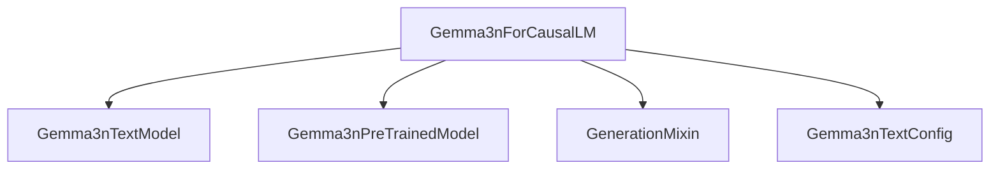

# `gemma3n_models`

The `gemma3n_models` module provides the implementation for the Gemma3n causal language model, `Gemma3nForCausalLM`. This module is designed for text generation tasks, leveraging the Gemma3n architecture.

## Architecture

The `gemma3n_models` module primarily centers around the `Gemma3nForCausalLM` class, which combines the core Gemma3n text model with the `GenerationMixin` for enhanced generation capabilities. It inherits from `Gemma3nPreTrainedModel` to ensure proper weight initialization and model handling within the Transformers ecosystem.

<!-- DIAGRAM_JSON
{
    "direction": "TD",
    "nodes": [
        {"id": "gemma3n_for_causal_lm", "label": "Gemma3nForCausalLM", "type": "component", "link": null},
        {"id": "gemma3n_text_model", "label": "Gemma3nTextModel", "type": "component", "link": null},
        {"id": "gemma3n_pretrained_model", "label": "Gemma3nPreTrainedModel", "type": "component", "link": null},
        {"id": "gemma3n_text_config", "label": "Gemma3nTextConfig", "type": "component", "link": null},
        {"id": "generation_mixin", "label": "GenerationMixin", "type": "external", "link": "generation_mixins.md"}
    ],
    "edges": [
        {"source": "gemma3n_for_causal_lm", "target": "gemma3n_text_model"},
        {"source": "gemma3n_for_causal_lm", "target": "gemma3n_pretrained_model"},
        {"source": "gemma3n_for_causal_lm", "target": "generation_mixin"},
        {"source": "gemma3n_for_causal_lm", "target": "gemma3n_text_config"}
    ],
    "groups": []
}
-->


### Component: `Gemma3nForCausalLM`

- **Located in**: `src/transformers/models/gemma3n/modeling_gemma3n.py`
- **Purpose**: This class is the primary interface for using the Gemma3n model for causal language modeling. It encapsulates the Gemma3n transformer backbone and an `lm_head` for generating logits over the vocabulary.

#### Core Functionality

`Gemma3nForCausalLM` is designed for sequence-to-sequence generation tasks, where the model predicts the next token in a sequence based on the preceding tokens. It integrates with the `GenerationMixin` ([generation_mixins.md](generation_mixins.md)) to provide a rich set of methods for text generation, such as `generate`.

**Key Attributes:**

- `_tied_weights_keys`: Specifies that the `lm_head.weight` is tied to `model.embed_tokens.weight`, a common optimization in language models to reduce parameter count.
- `_tp_plan`: Defines the tensor parallelism plan for `lm_head` as `colwise_gather_output`.
- `_pp_plan`: Defines the pipeline parallelism plan for `lm_head`.
- `config`: An instance of `Gemma3nTextConfig` that holds the model's hyperparameters.
- `model`: An instance of `Gemma3nTextModel` which is the transformer backbone of the Gemma3n model.
- `lm_head`: A linear layer that projects the hidden states to the vocabulary size to produce logits.

#### `forward` Method

```python
@can_return_tuple
@auto_docstring
def forward(
    self,
    input_ids: torch.LongTensor | None = None,
    attention_mask: torch.Tensor | None = None,
    position_ids: torch.LongTensor | None = None,
    past_key_values: Cache | None = None,
    inputs_embeds: torch.FloatTensor | None = None,
    labels: torch.LongTensor | None = None,
    use_cache: bool | None = None,
    logits_to_keep: int | torch.Tensor = 0,
    **kwargs: Unpack[TransformersKwargs],
) -> CausalLMOutputWithPast:
    # ... (implementation details) ...
```

The `forward` method processes input sequences and generates output logits. It supports various inputs for flexible usage, including `input_ids`, `attention_mask`, `position_ids`, `past_key_values` for optimized decoding, and `labels` for computing the causal language modeling loss.

**Parameters:**

- `input_ids`: Indices of input sequence tokens in the vocabulary.
- `attention_mask`: Mask to avoid performing attention on padding token indices.
- `position_ids`: Positional embeddings for `input_ids`.
- `past_key_values`: Cached past key and value states to speed up decoding.
- `inputs_embeds`: Optional pre-computed input embeddings instead of `input_ids`.
- `labels`: Optional target labels for causal language modeling. If provided, a loss is computed.
- `use_cache`: Boolean flag to enable/disable the return of `past_key_values`.
- `logits_to_keep`: An integer or tensor indicating how many logits to keep from the end of the sequence. Useful for memory optimization during generation.

**Output:**

Returns a `CausalLMOutputWithPast` object containing:

- `loss`: Causal language modeling loss (if `labels` are provided).
- `logits`: The prediction scores of the language modeling head.
- `past_key_values`: Key and value states of the attention blocks if `use_cache` is `True`.
- `hidden_states`: Hidden states of the model at the output of each layer.
- `attentions`: Attention weights if `output_attentions` is `True`.

#### Usage Example

The `forward` method is typically called internally by the `generate` method (provided by `GenerationMixin`) for text generation. The example provided in the code snippet demonstrates how to use `Gemma3nForCausalLM` with a tokenizer to generate text:

```python
>>> from transformers import AutoTokenizer, Gemma3nForCausalLM

>>> model = Gemma3nForCausalLM.from_pretrained("google/gemma-2-9b")
>>> tokenizer = AutoTokenizer.from_pretrained("google/gemma-2-9b")

>>> prompt = "What is your favorite condiment?"
>>> inputs = tokenizer(prompt, return_tensors="pt")

>>> # Generate
>>> generate_ids = model.generate(inputs.input_ids, max_length=30)
>>> tokenizer.batch_decode(generate_ids, skip_special_tokens=True, clean_up_tokenization_spaces=False)[0]
"What is your favorite condiment?"
```