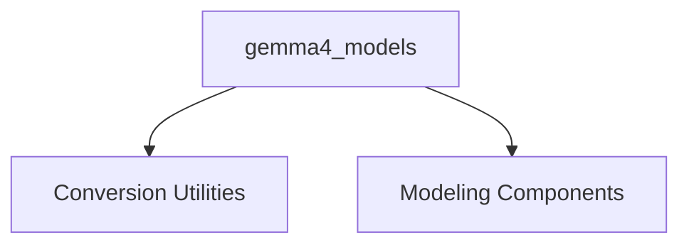

## `gemma4_models` Module Overview

### Purpose
The `gemma4_models` module provides the core implementation for the Gemma4 architecture, encompassing functionalities for causal language modeling and utilities for converting pre-trained models to the Hugging Face format. It includes both a standard causal language model and a modular text model, designed for efficient and flexible text generation.

### Architecture

### Core Components Documentation
The `gemma4_models` module is structured into two main sub-modules:

*   **Conversion Utilities**: This sub-module handles the conversion of Gemma4 model weights from their original format to the Hugging Face Transformers format.
    *   `src.transformers.models.gemma4.convert_gemma4_weights.main`
    *   [View `conversion_utils` documentation](conversion_utils.md)

*   **Modeling Components**: This sub-module contains the core implementations of the Gemma4 model architecture, including the causal language model and the base text model.
    *   `src.transformers.models.gemma4.modeling_gemma4.Gemma4ForCausalLM`
    *   `src.transformers.models.gemma4.modular_gemma4.Gemma4TextModel`
    *   [View `modeling` documentation](modeling.md)