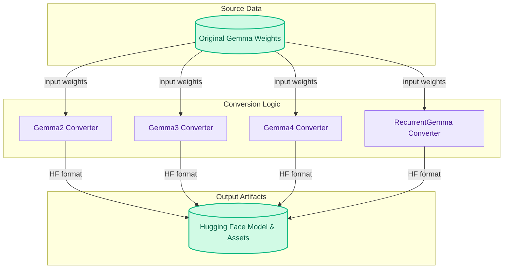

# Gemma Family Model Converters

This module provides comprehensive scripts for converting various Gemma family models, including Gemma2, Gemma3, Gemma4, and RecurrentGemma, along with their respective tokenizers and multimodal assets, into the standard Hugging Face Transformers format.

<!-- DIAGRAM_JSON
{
    "direction": "TD",
    "nodes": [
        {"id": "original_gemma_weights", "label": "Original Gemma Weights", "type": "data"},
        {"id": "gemma2_converter", "label": "Gemma2 Converter", "type": "analytical"},
        {"id": "gemma3_converter", "label": "Gemma3 Converter", "type": "analytical"},
        {"id": "gemma4_converter", "label": "Gemma4 Converter", "type": "analytical"},
        {"id": "recurrent_gemma_converter", "label": "RecurrentGemma Converter", "type": "analytical"},
        {"id": "hf_model_and_tokenizer", "label": "Hugging Face Model & Assets", "type": "data"}
    ],
    "edges": [
        {"source": "original_gemma_weights", "target": "gemma2_converter", "label": "input weights"},
        {"source": "original_gemma_weights", "target": "gemma3_converter", "label": "input weights"},
        {"source": "original_gemma_weights", "target": "gemma4_converter", "label": "input weights"},
        {"source": "original_gemma_weights", "target": "recurrent_gemma_converter", "label": "input weights"},
        {"source": "gemma2_converter", "target": "hf_model_and_tokenizer", "label": "HF format"},
        {"source": "gemma3_converter", "target": "hf_model_and_tokenizer", "label": "HF format"},
        {"source": "gemma4_converter", "target": "hf_model_and_tokenizer", "label": "HF format"},
        {"source": "recurrent_gemma_converter", "target": "hf_model_and_tokenizer", "label": "HF format"}
    ],
    "groups": [
        {"id": "source_data", "label": "Source Data", "role": "data", "nodes": ["original_gemma_weights"]},
        {"id": "conversion_logic", "label": "Conversion Logic", "role": "analytical", "nodes": ["gemma2_converter", "gemma3_converter", "gemma4_converter", "recurrent_gemma_converter"]},
        {"id": "output_artifacts", "label": "Output Artifacts", "role": "data", "nodes": ["hf_model_and_tokenizer"]}
    ]
}
-->
