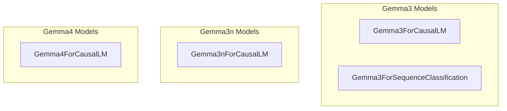

# Gemma Language Models
This module provides various Gemma model implementations for causal language modeling and sequence classification, including versions 3, 3n, and 4.

<!-- DIAGRAM_JSON
{
  "nodes": [
    {"id": "Gemma3ForCausalLM", "label": "Gemma3ForCausalLM", "type": "class"},
    {"id": "Gemma3ForSequenceClassification", "label": "Gemma3ForSequenceClassification", "type": "class"},
    {"id": "Gemma3nForCausalLM", "label": "Gemma3nForCausalLM", "type": "class"},
    {"id": "Gemma4ForCausalLM", "label": "Gemma4ForCausalLM", "type": "class"}
  ],
  "edges": [],
  "groups": [
    {"id": "gemma3_models", "label": "Gemma3 Models", "nodes": ["Gemma3ForCausalLM", "Gemma3ForSequenceClassification"]},
    {"id": "gemma3n_models", "label": "Gemma3n Models", "nodes": ["Gemma3nForCausalLM"]},
    {"id": "gemma4_models", "label": "Gemma4 Models", "nodes": ["Gemma4ForCausalLM"]}
  ]
}
-->
