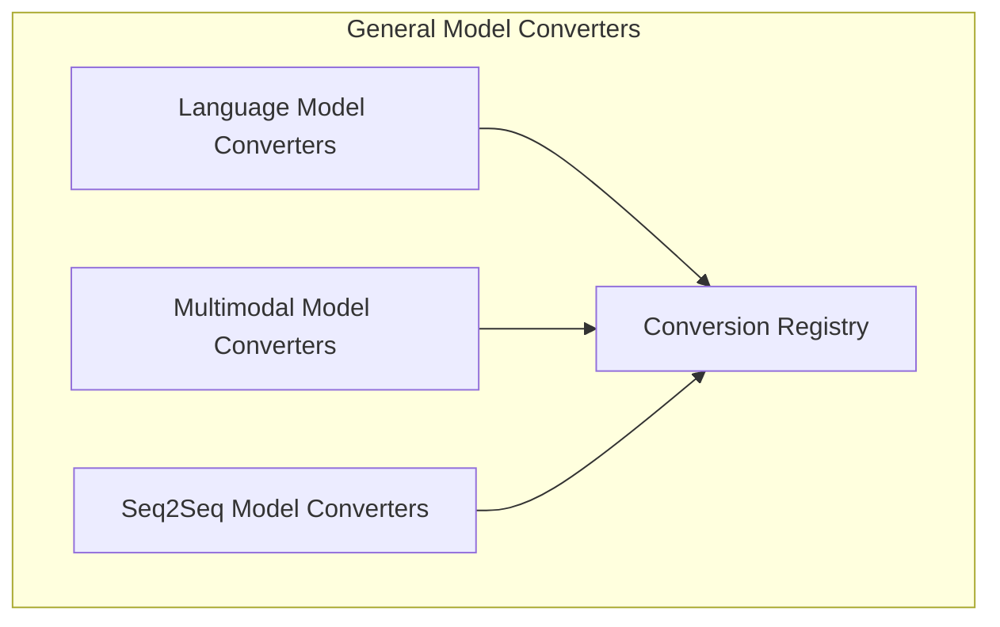

# General Model Converters Module Documentation

## Introduction and Purpose

The `general_model_converters` module serves as a centralized hub for converting various machine learning models from their original frameworks or formats into a unified Hugging Face Transformers compatible structure. This module is crucial for enabling interoperability and leveraging the extensive ecosystem of tools and functionalities provided by Hugging Face. It simplifies the process of migrating models, making them readily available for further fine-tuning, inference, and integration within different applications.

## Architecture Overview

The module is structured into several sub-modules, each responsible for specific types of conversions or model families. This modular design enhances maintainability, allows for specialized conversion logic, and improves the overall scalability of the conversion process.

<!-- DIAGRAM_JSON
{
    "direction": "TD",
    "nodes": [
        {"id": "conversion_registry", "label": "Conversion Registry", "type": "module", "link": "conversion_registry.md"},
        {"id": "language_model_converters", "label": "Language Model Converters", "type": "module", "link": "language_model_converters.md"},
        {"id": "multimodal_converters", "label": "Multimodal Model Converters", "type": "module", "link": "multimodal_converters.md"},
        {"id": "seq2seq_converters", "label": "Seq2Seq Model Converters", "type": "module", "link": "seq2seq_converters.md"}
    ],
    "edges": [
        {"source": "language_model_converters", "target": "conversion_registry"},
        {"source": "multimodal_converters", "target": "conversion_registry"},
        {"source": "seq2seq_converters", "target": "conversion_registry"}
    ],
    "groups": []
}
-->

## Sub-modules

*   ### [Conversion Registry](conversion_registry.md)
    This sub-module provides utilities for registering and managing checkpoint conversion mappings, serving as a foundational component for the entire conversion system.

*   ### [Language Model Converters](language_model_converters.md)
    This sub-module specializes in converting various language models, such as Gemma2 and Dia, into the Hugging Face Transformers format, ensuring compatibility and ease of use within the ecosystem.

*   ### [Multimodal Model Converters](multimodal_converters.md)
    Focused on models that integrate multiple data types (e.g., image and text), this sub-module handles the conversion of models like BLIP, Grounding DINO, and InstructBLIP-Video.

*   ### [Seq2Seq Model Converters](seq2seq_converters.md)
    This sub-module is dedicated to the conversion of sequence-to-sequence models, including BigBird-Pegasus, from their original frameworks to a Hugging Face compatible format.
