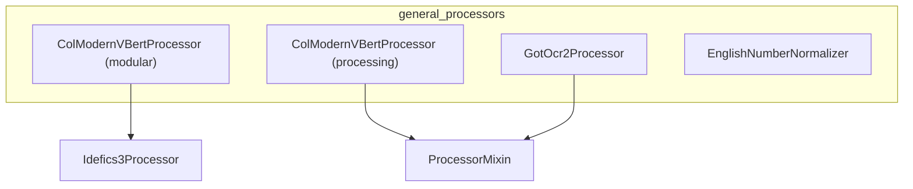

# general_processors
This module provides a collection of diverse processing components, including specialized image and text processors for models like ColModernVBert and GotOcr2, and a utility for English number normalization.

<!-- DIAGRAM_JSON
{
  "nodes": [
    {"id": "CMVBP1", "label": "ColModernVBertProcessor (modular)", "description": "src.transformers.models.colmodernvbert.modular_colmodernvbert.ColModernVBertProcessor"},
    {"id": "CMVBP2", "label": "ColModernVBertProcessor (processing)", "description": "src.transformers.models.colmodernvbert.processing_colmodernvbert.ColModernVBertProcessor"},
    {"id": "GOP", "label": "GotOcr2Processor", "description": "src.transformers.models.got_ocr2.processing_got_ocr2.GotOcr2Processor"},
    {"id": "ENN", "label": "EnglishNumberNormalizer", "description": "src.transformers.models.speecht5.number_normalizer.EnglishNumberNormalizer"},
    {"id": "Idefics3Processor", "label": "Idefics3Processor", "description": "Base class for ColModernVBertProcessor (modular)"},
    {"id": "ProcessorMixin", "label": "ProcessorMixin", "description": "Base class for various processors"}
  ],
  "edges": [
    {"source": "CMVBP1", "target": "Idefics3Processor", "label": "inherits"},
    {"source": "CMVBP2", "target": "ProcessorMixin", "label": "inherits"},
    {"source": "GOP", "target": "ProcessorMixin", "label": "inherits"}
  ],
  "groups": [
    {"id": "general_processors", "label": "general_processors", "nodes": ["CMVBP1", "CMVBP2", "GOP", "ENN"]}
  ]
}
-->
