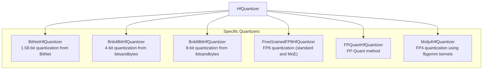

# general_quantization
This module provides a collection of Hugging Face quantizers, implementing various quantization methods like BitNet, bitsandbytes (4-bit and 8-bit), FP8, FP-Quant, and MXFP4 for efficient model deployment.

<!-- DIAGRAM_JSON
{
  "nodes": [
    {"id": "HfQuantizer", "label": "HfQuantizer"},
    {"id": "BitNetHfQuantizer", "label": "BitNetHfQuantizer", "description": "1.58-bit quantization from BitNet"},
    {"id": "Bnb4BitHfQuantizer", "label": "Bnb4BitHfQuantizer", "description": "4-bit quantization from bitsandbytes"},
    {"id": "Bnb8BitHfQuantizer", "label": "Bnb8BitHfQuantizer", "description": "8-bit quantization from bitsandbytes"},
    {"id": "FineGrainedFP8HfQuantizer", "label": "FineGrainedFP8HfQuantizer", "description": "FP8 quantization (standard and MoE)"},
    {"id": "FPQuantHfQuantizer", "label": "FPQuantHfQuantizer", "description": "FP-Quant method"},
    {"id": "Mxfp4HfQuantizer", "label": "Mxfp4HfQuantizer", "description": "FP4 quantization using fbgemm kernels"}
  ],
  "edges": [
    {"source": "HfQuantizer", "target": "BitNetHfQuantizer"},
    {"source": "HfQuantizer", "target": "Bnb4BitHfQuantizer"},
    {"source": "HfQuantizer", "target": "Bnb8BitHfQuantizer"},
    {"source": "HfQuantizer", "target": "FineGrainedFP8HfQuantizer"},
    {"source": "HfQuantizer", "target": "FPQuantHfQuantizer"},
    {"source": "HfQuantizer", "target": "Mxfp4HfQuantizer"}
  ],
  "groups": [
    {"id": "Quantizers", "label": "Specific Quantizers", "nodes": ["BitNetHfQuantizer", "Bnb4BitHfQuantizer", "Bnb8BitHfQuantizer", "FineGrainedFP8HfQuantizer", "FPQuantHfQuantizer", "Mxfp4HfQuantizer"]}
  ]
}
-->
