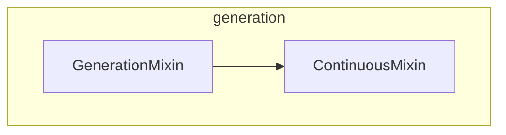

# generation
The `generation` module provides foundational mixin classes for implementing advanced text generation strategies, including auto-regressive decoding and continuous batching for efficient inference.

<!-- DIAGRAM_JSON
{
    "nodes": [
        {
            "id": "generation",
            "label": "generation",
            "type": "module"
        },
        {
            "id": "ContinuousMixin",
            "label": "ContinuousMixin"
        },
        {
            "id": "GenerationMixin",
            "label": "GenerationMixin"
        },
        {
            "id": "core_generation_logic",
            "label": "Core Generation Logic",
            "type": "module",
            "link": "core_generation_logic.md"
        },
        {
            "id": "continuous_batching",
            "label": "Continuous Batching",
            "type": "module",
            "link": "continuous_batching.md"
        }
    ],
    "edges": [
        {
            "source": "GenerationMixin",
            "target": "ContinuousMixin",
            "label": "inherits"
        },
        {
            "source": "ContinuousMixin",
            "target": "core_generation_logic"
        },
        {
            "source": "ContinuousMixin",
            "target": "continuous_batching"
        }
    ],
    "groups": [
        {
            "id": "generation__group",
            "label": "generation",
            "nodes": [
                "ContinuousMixin",
                "GenerationMixin"
            ],
            "_repaired": "r4_group_renamed_avoid_node_collision"
        }
    ]
}
-->
