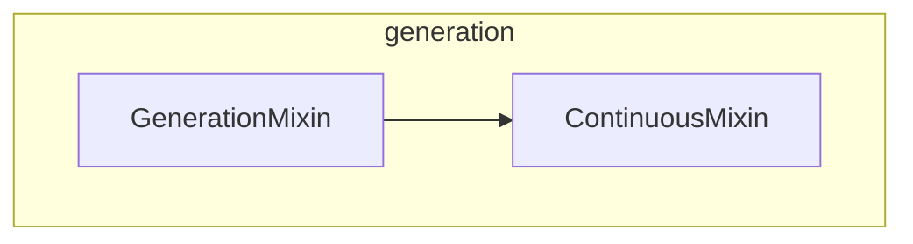

# generation
The `generation` module provides foundational mixin classes for implementing advanced text generation strategies, including auto-regressive decoding and continuous batching for efficient inference.

<!-- DIAGRAM_JSON
{
  "nodes": [
    {"id": "ContinuousMixin", "label": "ContinuousMixin"},
    {"id": "GenerationMixin", "label": "GenerationMixin"}
  ],
  "edges": [
    {"source": "GenerationMixin", "target": "ContinuousMixin", "label": "inherits"}
  ],
  "groups": [
    {"id": "generation", "label": "generation", "nodes": ["ContinuousMixin", "GenerationMixin"]}
  ]
}
-->
