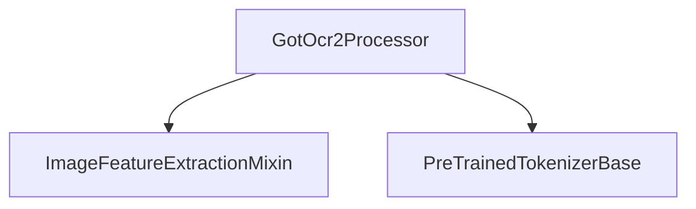

# `got_ocr2_models`

The `got_ocr2_models` module is a crucial part of the `transformers` library, specifically designed for multimodal processing related to Optical Character Recognition (OCR). It provides the `GotOcr2Processor` which unifies image processing and text tokenization, enabling models to handle visual and textual inputs seamlessly for OCR tasks.

## Core Functionality

The primary component of this module is `GotOcr2Processor`.

### `GotOcr2Processor`

```python
class GotOcr2Processor(ProcessorMixin):
    def __init__(self, image_processor=None, tokenizer=None, chat_template=None, **kwargs):
        super().__init__(image_processor, tokenizer, chat_template=chat_template)

        self.message_start_token = "<|im_start|>"
        self.message_end_token = "<|im_end|>"
        self.img_start_token = ""
        self.img_end_token = "</img>"
        self.img_pad_token = "<imgpad>"
        self.image_token = "<imgpad>"  # keep the above for BC, but we need to call it `image_token`
        self.image_token_id = tokenizer.convert_tokens_to_ids(self.image_token)
        self.system_query = "system
You should follow the instructions carefully and explain your answers in detail."

    # ... (methods omitted for brevity)

    def __call__(
        self,
        images: ImageInput | None = None,
        text: TextInput | PreTokenizedInput | list[TextInput] | list[PreTokenizedInput] | None = None,
        **kwargs: Unpack[GotOcr2ProcessorKwargs],
    ) -> BatchFeature:
        # ... (implementation omitted for brevity)
```

The `GotOcr2Processor` is responsible for preprocessing inputs for models that combine image and text for OCR. It streamlines the preparation of data by handling image transformations and text tokenization within a single interface.

#### Initialization

- **`image_processor`**: An instance of an image processor (e.g., inheriting from [`ImageFeatureExtractionMixin`](image_feature_extraction.md)) that handles image pre-processing steps like resizing, normalization, and converting images to tensors.
- **`tokenizer`**: An instance of a tokenizer (e.g., inheriting from [`PreTrainedTokenizerBase`](tokenizer_base.md)) responsible for converting text into token IDs.
- **`chat_template`**: Optional chat template for formatting conversational inputs.

During initialization, it defines several special tokens such as `<|im_start|>`, `<|im_end|>`, ``, `</img>`, and `<imgpad>` that are used to structure multimodal inputs.

#### `__call__` method

This method is the primary entry point for processing inputs. It accepts `images` and `text` along with various keyword arguments to control the preprocessing pipeline:

1.  **Input Normalization**: The `_make_list_of_inputs` helper function normalizes the `images`, `text`, `box`, and `color` inputs, ensuring they are in a consistent list format, especially when dealing with multi-page documents or multiple images.
2.  **Image Processing**: Images are loaded and then processed using the `image_processor` instance, which handles tasks like cropping to patches and generating pixel values. The `num_patches` information is extracted here, which is crucial for constructing the image token sequence.
3.  **Prompt Generation (if `text` is `None`)**: If no text input is provided, the processor constructs a default OCR query. This query integrates information about `color`, `box` coordinates, multi-page settings, and patch references, formatted with the module's special tokens to create a multimodal prompt.
4.  **Text Tokenization**: The `text` (either provided by the user or generated as a prompt) is then tokenized using the `tokenizer` instance.
5.  **Special Token Check**: It verifies the correct usage of special multimodal tokens within the tokenized text inputs.
6.  **Output**: Finally, it returns a `BatchFeature` object containing both the processed `text_inputs` (token IDs and attention mask) and `image_inputs` (pixel values), ready to be fed to a multimodal model.

## Architecture and Component Relationships

The `got_ocr2_models` module, through its `GotOcr2Processor`, acts as an orchestrator, integrating functionalities from image processing and text tokenization modules. This separation of concerns allows for modularity and flexibility, as different image processors or tokenizers can be plugged in.

<!-- DIAGRAM_JSON
{
    "direction": "TD",
    "nodes": [
        {"id": "got_ocr2_processor", "label": "GotOcr2Processor", "type": "component", "link": null},
        {"id": "image_feature_extraction_mixin", "label": "ImageFeatureExtractionMixin", "type": "external", "link": "image_feature_extraction.md"},
        {"id": "tokenizer_base", "label": "PreTrainedTokenizerBase", "type": "external", "link": "tokenizer_base.md"}
    ],
    "edges": [
        {"source": "got_ocr2_processor", "target": "image_feature_extraction_mixin"},
        {"source": "got_ocr2_processor", "target": "tokenizer_base"}
    ],
    "groups": []
}
-->


## How the Module Fits into the Overall System

The `got_ocr2_models` module provides a specialized processor for handling OCR-specific multimodal inputs within the `transformers` ecosystem. By combining image processing and text tokenization into a single, cohesive unit, it simplifies the data preparation pipeline for OCR models. This module ensures that models can receive correctly formatted visual and textual data, enabling them to effectively perform tasks like extracting text from images, question answering over documents, and other document understanding tasks that require both visual and linguistic understanding. Its design leverages existing `transformers` utilities like `ImageFeatureExtractionMixin` and `PreTrainedTokenizerBase`, promoting reusability and consistency across the library.
