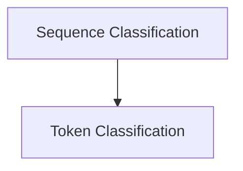

# GPT2 Classification Models

The `gpt2_classification_models` module provides implementations for various classification tasks utilizing the GPT2 transformer architecture. It includes models tailored for sequence-level classification (e.g., sentiment analysis) and token-level classification (e.g., named entity recognition).

## Architecture Overview

The module is structured into distinct components, each handling a specific classification task built upon the foundational GPT2 model. The primary sub-modules are:

- [Sequence Classification Model](sequence_classification_model.md): Manages sequence-level classification and regression.
- [Token Classification Model](token_classification_model.md): Handles token-level classification.

<!-- DIAGRAM_JSON
{
    "direction": "TD",
    "nodes": [
        {"id": "sequence_classification_model", "label": "Sequence Classification", "type": "module", "link": "sequence_classification_model.md"},
        {"id": "token_classification_model", "label": "Token Classification", "type": "module", "link": "token_classification_model.md"}
    ],
    "edges": [
        {"source": "sequence_classification_model", "target": "token_classification_model"}
    ],
    "groups": []
}
-->

## Sub-modules

### Sequence Classification Model
This sub-module ([`sequence_classification_model.md`](sequence_classification_model.md)) encapsulates the `GPT2ForSequenceClassification` component, designed for tasks where the entire input sequence is classified into one or more categories or a regression value is predicted.

### Token Classification Model
This sub-module ([`token_classification_model.md`](token_classification_model.md)) focuses on the `GPT2ForTokenClassification` component, which is used for tasks requiring a classification label for each token in the input sequence, such as named entity recognition or part-of-speech tagging.
