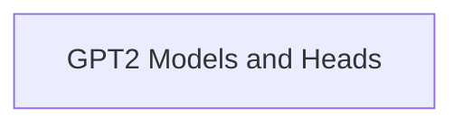

# GPT2 Language Modeling Module

## Introduction
The `gpt2_language_modeling` module provides core functionalities for GPT2-based language modeling tasks. It includes implementations for standard language modeling and a double-heads model capable of both language modeling and multiple-choice classification. This module leverages the underlying GPT2 transformer architecture for powerful text generation and understanding.

## Architecture Overview
The `gpt2_language_modeling` module is structured around its key modeling components, primarily the language modeling head and a dual-purpose head for sequence classification. These components interact with the base GPT2 transformer model to perform their respective tasks.

<!-- DIAGRAM_JSON
{
    "direction": "TD",
    "nodes": [
        {"id": "gpt2_models_and_heads", "label": "GPT2 Models and Heads", "type": "module", "link": "gpt2_models_and_heads.md"}
    ],
    "edges": [],
    "groups": []
}
-->

## Sub-modules
### [GPT2 Models and Heads](gpt2_models_and_heads.md)
This sub-module encapsulates the primary GPT2 modeling components, including `GPT2LMHeadModel` for causal language modeling and `GPT2DoubleHeadsModel` for tasks requiring both language modeling and multiple-choice classification. It integrates with the base GPT2 transformer to provide diverse capabilities.
