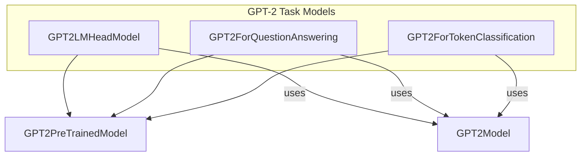

# gpt2_models
This module provides specialized GPT-2 models for various downstream tasks, including language modeling, question answering, and token classification, all leveraging the core GPT-2 transformer architecture.

<!-- DIAGRAM_JSON
{
  "nodes": [
    {"id": "GPT2PreTrainedModel", "label": "GPT2PreTrainedModel"},
    {"id": "GPT2Model", "label": "GPT2Model"},
    {"id": "GPT2LMHeadModel", "label": "GPT2LMHeadModel"},
    {"id": "GPT2ForQuestionAnswering", "label": "GPT2ForQuestionAnswering"},
    {"id": "GPT2ForTokenClassification", "label": "GPT2ForTokenClassification"}
  ],
  "edges": [
    {"source": "GPT2LMHeadModel", "target": "GPT2PreTrainedModel", "label": "inherits"},
    {"source": "GPT2ForQuestionAnswering", "target": "GPT2PreTrainedModel", "label": "inherits"},
    {"source": "GPT2ForTokenClassification", "target": "GPT2PreTrainedModel", "label": "inherits"},
    {"source": "GPT2LMHeadModel", "target": "GPT2Model", "label": "uses"},
    {"source": "GPT2ForQuestionAnswering", "target": "GPT2Model", "label": "uses"},
    {"source": "GPT2ForTokenClassification", "target": "GPT2Model", "label": "uses"}
  ],
  "groups": [
    {
      "id": "GPT2TaskModels",
      "label": "GPT-2 Task Models",
      "nodes": ["GPT2LMHeadModel", "GPT2ForQuestionAnswering", "GPT2ForTokenClassification"]
    }
  ]
}
-->
