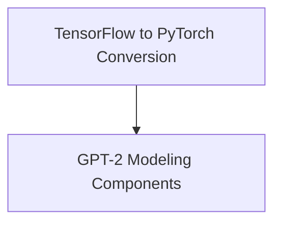

# GPT-2 Models Documentation

## Introduction

The `gpt2_models` module provides implementations and utilities for working with GPT-2 models, including functionalities for converting original TensorFlow checkpoints to PyTorch and various modeling heads for different downstream tasks such as language modeling, sequence classification, question answering, and token classification.

## Architecture Overview

This module is structured into core components handling model conversions and different model architectures tailored for specific tasks. The architecture facilitates both checkpoint migration and flexible model utilization.

<!-- DIAGRAM_JSON
{
    "direction": "TD",
    "nodes": [
        {"id": "conversion_to_pytorch", "label": "TensorFlow to PyTorch Conversion", "type": "module", "link": "conversion_to_pytorch.md"},
        {"id": "modeling_components", "label": "GPT-2 Modeling Components", "type": "module", "link": "modeling_components.md"}
    ],
    "edges": [
        {"source": "conversion_to_pytorch", "target": "modeling_components"}
    ],
    "groups": []
}
-->

## Sub-modules

### [TensorFlow to PyTorch Conversion](conversion_to_pytorch.md)

This sub-module focuses on the utility for converting original GPT-2 TensorFlow checkpoints into a PyTorch compatible format. This is crucial for enabling the use of pre-trained models from TensorFlow within the PyTorch ecosystem.

### [GPT-2 Modeling Components](modeling_components.md)

This sub-module encapsulates various GPT-2 model heads designed for different natural language processing tasks. It includes models for causal language modeling, sequence classification, question answering, and token classification, providing a versatile foundation for diverse applications.
