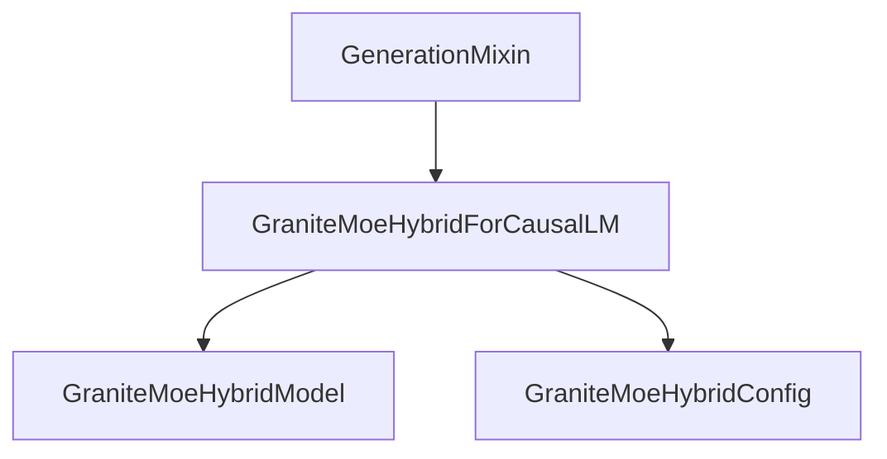

# granitemoehybrid_models

The `granitemoehybrid_models` module provides the core implementation for the GraniteMoEHybrid causal language model. It encapsulates the model's architecture, including its Mixture-of-Experts (MoE) routing mechanism, and integrates functionalities for text generation.

## Architecture and Component Relationships

This module primarily focuses on the `GraniteMoeHybridForCausalLM` class, which is responsible for the complete forward pass of the model, including handling input embeddings, attention mechanisms, expert routing, and generating output logits. It leverages internal components like `GraniteMoeHybridModel` for the base model operations and `GraniteMoeHybridConfig` for configuration parameters. It also integrates with the `GenerationMixin` from the `generation_mixins` module to provide standard generation capabilities.

<!-- DIAGRAM_JSON
{
    "direction": "TD",
    "nodes": [
        {"id": "granitemoehybrid_for_causal_lm", "label": "GraniteMoeHybridForCausalLM", "type": "component", "link": null},
        {"id": "granitemoehybrid_model", "label": "GraniteMoeHybridModel", "type": "component", "link": null},
        {"id": "granitemoehybrid_config", "label": "GraniteMoeHybridConfig", "type": "component", "link": null},
        {"id": "generation_mixin", "label": "GenerationMixin", "type": "external", "link": "generation_mixins.md"}
    ],
    "edges": [
        {"source": "granitemoehybrid_for_causal_lm", "target": "granitemoehybrid_model"},
        {"source": "granitemoehybrid_for_causal_lm", "target": "granitemoehybrid_config"},
        {"source": "generation_mixin", "target": "granitemoehybrid_for_causal_lm"}
    ],
    "groups": []
}
-->


### GraniteMoeHybridForCausalLM

The `GraniteMoeHybridForCausalLM` class is a specialized model designed for causal language modeling tasks using the Mixture-of-Experts (MoE) architecture. It extends `GraniteMoeHybridPreTrainedModel` (a base model for GraniteMoEHybrid architectures) and incorporates `GenerationMixin` for enhanced text generation functionalities.

**Core Functionality:**

*   **Initialization (`__init__`)**:
    *   Constructs the base `GraniteMoeHybridModel` and an `lm_head` (linear layer) for vocabulary projection.
    *   Configures parameters related to MoE, such as `num_experts`, `num_experts_per_tok`, and `router_aux_loss_coef`, based on the provided `GraniteMoeHybridConfig`.
*   **Forward Pass (`forward`)**:
    *   Processes input `input_ids`, `attention_mask`, `position_ids`, and `past_key_values` through the `GraniteMoeHybridModel`.
    *   Computes output `logits` from the hidden states using the `lm_head`.
    *   Scales logits by `self.config.logits_scaling`.
    *   Calculates the causal language modeling `loss` if `labels` are provided.
    *   Optionally computes an `aux_loss` for router load balancing using `load_balancing_loss_func` if `output_router_logits` is enabled. This auxiliary loss encourages a balanced distribution of tokens across experts.
    *   Combines the main loss with the router auxiliary loss, weighted by `router_aux_loss_coef`.
    *   Returns a `MoeCausalLMOutputWithPast` object containing loss, auxiliary loss, logits, past key values, hidden states, attentions, and router logits.

**Key Features:**

*   **Mixture-of-Experts (MoE) Support**: Integrates routing mechanisms for dynamically selecting experts for each token, allowing for efficient scaling and improved performance.
*   **Causal Language Modeling**: Designed for tasks where the model predicts the next token in a sequence, such as text generation.
*   **Generation Capabilities**: Inherits methods from [generation_mixins](generation_mixins.md) for flexible text generation strategies (e.g., beam search, sampling).
*   **Router Auxiliary Loss**: Includes a mechanism to encourage balanced expert utilization during training, preventing some experts from being underutilized.

**Usage Example:**

The provided example demonstrates how to load a pre-trained `GraniteMoeHybridForCausalLM` model and tokenizer, then use it to generate text.

```python
>>> from transformers import AutoTokenizer, GraniteMoeHybridForCausalLM

>>> model = GraniteMoeHybridForCausalLM.from_pretrained("ibm-granite/granite-4.0-h-tiny")
>>> tokenizer = AutoTokenizer.from_pretrained("ibm-granite/granite-4.0-h-tiny")

>>> prompt = "Hey, are you conscious? Can you talk to me?"
>>> inputs = tokenizer(prompt, return_tensors="pt")

>>> # Generate
>>> generate_ids = model.generate(inputs.input_ids, max_length=30)
>>> tokenizer.batch_decode(generate_ids, skip_special_tokens=True, clean_up_tokenization_spaces=False)[0]
"Hey, are you conscious? Can you talk to me?
I'm not conscious, but I can talk to you."
```