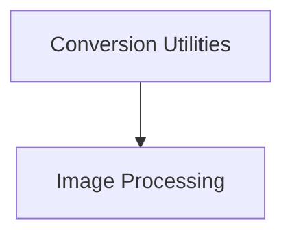

# GroundingDino Models Documentation

The `grounding_dino_models` module provides the necessary components for working with GroundingDino models, including utilities for converting checkpoints and processing images for object detection tasks.

## Architecture Overview

The module is composed of two main sub-modules:

- **[Conversion Utilities](conversion_utilities.md)**: Manages the conversion of GroundingDino checkpoints to a compatible format.
- **[Image Processing](image_processing.md)**: Handles the preprocessing of images and annotations for GroundingDino models.

### Module Diagram

<!-- DIAGRAM_JSON
{
    "direction": "TD",
    "nodes": [
        {"id": "conversion_utilities", "label": "Conversion Utilities", "type": "module", "link": "conversion_utilities.md"},
        {"id": "image_processing", "label": "Image Processing", "type": "module", "link": "image_processing.md"}
    ],
    "edges": [
        {"source": "conversion_utilities", "target": "image_processing"}
    ],
    "groups": []
}
-->

## Sub-modules

### [Conversion Utilities](conversion_utilities.md)
This sub-module focuses on the conversion of original GroundingDino checkpoints to the Hugging Face format, including state dict renaming and verification.

### [Image Processing](image_processing.md)
This sub-module provides image preprocessing functionalities for GroundingDino models using the PIL backend, including resizing, normalization, padding, and annotation handling.
