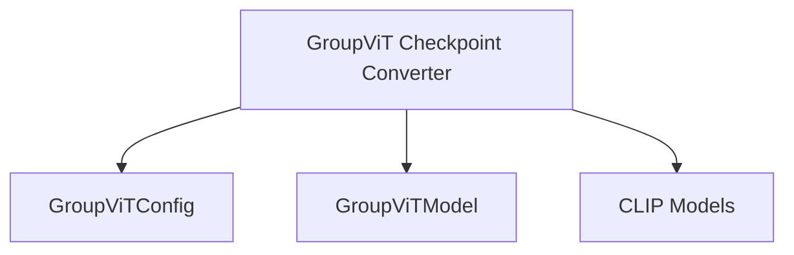

# groupvit_models

## Introduction
The `groupvit_models` module is responsible for handling operations related to the GroupViT model, with a primary focus on converting pre-trained GroupViT checkpoints from NVLAB format to the Hugging Face Transformers format. It also includes mechanisms for verifying the conversion and pushing the converted models to the Hugging Face Hub.

## Module Architecture and Component Relationships

<!-- DIAGRAM_JSON
{
    "direction": "TD",
    "nodes": [
        {"id": "groupvit_checkpoint_converter", "label": "GroupViT Checkpoint Converter", "type": "component", "link": null},
        {"id": "groupvit_config", "label": "GroupViTConfig", "type": "component", "link": null},
        {"id": "groupvit_model", "label": "GroupViTModel", "type": "component", "link": null},
        {"id": "clip_models", "label": "CLIP Models", "type": "external", "link": "clip_models.md"}
    ],
    "edges": [
        {"source": "groupvit_checkpoint_converter", "target": "groupvit_config"},
        {"source": "groupvit_checkpoint_converter", "target": "groupvit_model"},
        {"source": "groupvit_checkpoint_converter", "target": "clip_models"}
    ],
    "groups": []
}
-->

## Core Functionality

### `convert_groupvit_checkpoint`
This function is central to the `groupvit_models` module, facilitating the conversion of GroupViT model checkpoints from their original NVLAB format to a format compatible with the Hugging Face Transformers library. It initializes a `GroupViTModel` with a `GroupViTConfig`, loads the state dictionary from the provided checkpoint, and then transforms it to match the Hugging Face model's architecture.

**Parameters**:
- `checkpoint_path` (`str`): The file path to the original GroupViT checkpoint.
- `pytorch_dump_folder_path` (`str`): The directory where the converted model and processor will be saved.
- `model_name` (`str`, optional): The name of the GroupViT model (e.g., "groupvit-gcc-yfcc", "groupvit-gcc-redcaps"). Used for verification. Defaults to "groupvit-gcc-yfcc".
- `push_to_hub` (`bool`, optional): If `True`, the converted model and processor will be pushed to the Hugging Face Hub. Defaults to `False`.

**Process**:
1. **Configuration and Model Initialization**: A `GroupViTConfig` is instantiated to define the model's architecture, and a `GroupViTModel` is then created using this configuration.
2. **State Dictionary Loading and Conversion**: The original state dictionary is loaded from the `checkpoint_path`. An internal `convert_state_dict` helper function (not detailed here but assumed to perform the necessary key mapping and weight adjustments) processes this dictionary.
3. **Model Loading**: The converted state dictionary is loaded into the Hugging Face `GroupViTModel`. Assertions check for expected missing or unexpected keys to ensure a clean conversion.
4. **Verification**: The conversion is verified by performing a forward pass with sample image and text inputs using a `CLIPProcessor` (an external dependency from the [clip_models](clip_models.md) module). The output logits are compared against expected values specific to the `model_name`.
5. **Saving and Pushing**: The converted model and the `CLIPProcessor` are saved to `pytorch_dump_folder_path`. If `push_to_hub` is `True`, they are also uploaded to the Hugging Face Hub.

**Dependencies**:
- `GroupViTConfig`: Defines the model's configuration.
- `GroupViTModel`: The core GroupViT model architecture.
- `torch`: Used for tensor operations and loading model weights.
- `CLIPProcessor` (from [clip_models](clip_models.md)): Utilized for preparing inputs and verifying the model's output after conversion.

## How the Module Fits into the Overall System
The `groupvit_models` module plays a crucial role in enabling the interoperability of GroupViT models within the Hugging Face ecosystem. By providing a clear and verifiable conversion path, it allows researchers and developers to leverage pre-trained GroupViT models and integrate them seamlessly into applications built with the Hugging Face Transformers library. This module acts as a bridge, ensuring that models trained in different frameworks can be easily adopted and utilized.