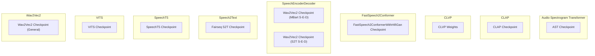

# hf_audio_conversion_utilities
This module provides utilities for converting checkpoints of various audio models from their original formats to the Hugging Face Transformers format, facilitating interoperability and use within the ecosystem.

<!-- DIAGRAM_JSON
{
  "nodes": [
    { "id": "A", "label": "convert_audio_spectrogram_transformer_checkpoint" },
    { "id": "B", "label": "convert_clap_checkpoint" },
    { "id": "C", "label": "convert_clvp_weights" },
    { "id": "D", "label": "convert_FastSpeech2ConformerWithHifiGan_checkpoint" },
    { "id": "E", "label": "convert_wav2vec2_checkpoint (MBart SpeechEncoderDecoder)" },
    { "id": "F", "label": "convert_wav2vec2_checkpoint (Speech2Text SpeechEncoderDecoder)" },
    { "id": "G", "label": "convert_fairseq_s2t_checkpoint_to_tfms" },
    { "id": "H", "label": "convert_speecht5_checkpoint" },
    { "id": "I", "label": "convert_checkpoint (VITS)" },
    { "id": "J", "label": "convert_wav2vec2_checkpoint (Wav2Vec2)" }
  ],
  "edges": [],
  "groups": [
    { "id": "Audio Spectrogram Transformer", "label": "Audio Spectrogram Transformer", "nodes": ["A"] },
    { "id": "CLAP", "label": "CLAP", "nodes": ["B"] },
    { "id": "CLVP", "label": "CLVP", "nodes": ["C"] },
    { "id": "FastSpeech2Conformer", "label": "FastSpeech2Conformer", "nodes": ["D"] },
    { "id": "SpeechEncoderDecoder", "label": "SpeechEncoderDecoder", "nodes": ["E", "F"] },
    { "id": "Speech2Text", "label": "Speech2Text", "nodes": ["G"] },
    { "id": "SpeechT5", "label": "SpeechT5", "nodes": ["H"] },
    { "id": "VITS", "label": "VITS", "nodes": ["I"] },
    { "id": "Wav2Vec2", "label": "Wav2Vec2", "nodes": ["J"] }
  ]
}
-->
