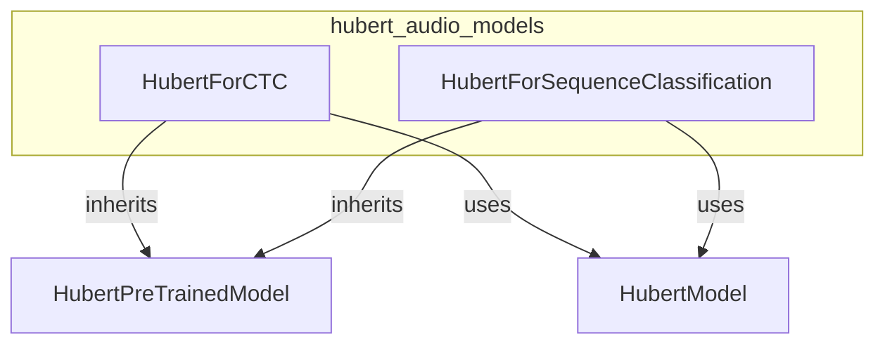

# hubert_audio_models
This module provides specialized Hubert models for audio tasks, including Connectionist Temporal Classification (CTC) for speech recognition and sequence classification.

<!-- DIAGRAM_JSON
{
    "nodes": [
        {
            "id": "hubert_audio_models",
            "label": "hubert_audio_models",
            "type": "module"
        },
        {
            "id": "HubertForCTC",
            "label": "HubertForCTC",
            "type": "component"
        },
        {
            "id": "HubertForSequenceClassification",
            "label": "HubertForSequenceClassification",
            "type": "component"
        },
        {
            "id": "HubertPreTrainedModel",
            "label": "HubertPreTrainedModel",
            "type": "base_class"
        },
        {
            "id": "HubertModel",
            "label": "HubertModel",
            "type": "dependency"
        }
    ],
    "edges": [
        {
            "source": "HubertForCTC",
            "target": "HubertPreTrainedModel",
            "type": "inherits"
        },
        {
            "source": "HubertForSequenceClassification",
            "target": "HubertPreTrainedModel",
            "type": "inherits"
        },
        {
            "source": "HubertForCTC",
            "target": "HubertModel",
            "type": "uses"
        },
        {
            "source": "HubertForSequenceClassification",
            "target": "HubertModel",
            "type": "uses"
        }
    ],
    "groups": []
}
-->
