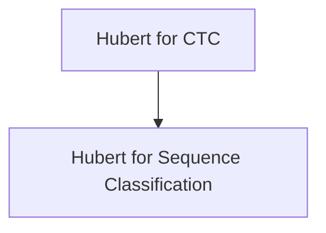

# Hubert Models Documentation

## Introduction
The `hubert_models` module provides implementations of the Hubert model for various downstream tasks, specifically focusing on Connectionist Temporal Classification (CTC) and sequence classification. Hubert is a self-supervised speech model pre-trained on a large amount of unlabeled speech data, making it highly effective for fine-tuning on diverse speech-related tasks.

## Architecture Overview
The Hubert models within this module leverage the core Hubert architecture and extend it with specific heads for CTC and sequence classification. The architecture generally consists of a feature encoder, a Transformer encoder, and a task-specific head.

<!-- DIAGRAM_JSON
{
    "direction": "TD",
    "nodes": [
        {"id": "hubert_for_ctc", "label": "Hubert for CTC", "type": "module", "link": "hubert_for_ctc.md"},
        {"id": "hubert_for_sequence_classification", "label": "Hubert for Sequence Classification", "type": "module", "link": "hubert_for_sequence_classification.md"}
    ],
    "edges": [
        {"source": "hubert_for_ctc", "target": "hubert_for_sequence_classification"}
    ],
    "groups": []
}
-->

## Sub-modules

### [Hubert for CTC](hubert_for_ctc.md)
This sub-module contains the `HubertForCTC` class, which adapts the Hubert model for Connectionist Temporal Classification tasks. It is primarily used in automatic speech recognition (ASR) systems where the goal is to predict a sequence of labels from an input sequence of speech.

### [Hubert for Sequence Classification](hubert_for_sequence_classification.md)
This sub-module provides the `HubertForSequenceClassification` class, designed for tasks involving the classification of entire audio sequences. Examples include sentiment analysis from speech or speaker identification.
