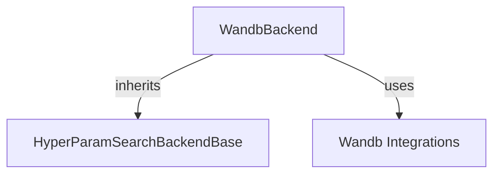

# Hyperparameter Search Module

The `hyperparameter_search` module provides tools and backends for performing hyperparameter optimization within the system. It abstracts away the specifics of different hyperparameter search libraries, offering a unified interface for integrating various backend services like Weights & Biases (WandB).

## Core Functionality

This module primarily focuses on integrating with external hyperparameter optimization frameworks. The `WandbBackend` class is a key component, enabling seamless integration with Weights & Biases for experiment tracking and hyperparameter tuning.

### `WandbBackend`

The `WandbBackend` class serves as an adapter for the Weights & Biases (WandB) library. It implements the `HyperParamSearchBackendBase` interface (presumably defined elsewhere) to provide a standardized way to interact with hyperparameter search backends.

- **`name`**: A static attribute set to `"wandb"`, identifying this backend.
- **`is_available()`**: A static method that checks if the WandB library is installed and available in the current environment. This ensures that the backend is only used when its underlying dependency is met.
- **`run(self, trainer, n_trials: int, direction: str, **kwargs)`**: This method orchestrates a hyperparameter search run using WandB. It takes a `trainer` object, the number of trials (`n_trials`), the optimization direction (`direction`), and additional keyword arguments specific to the WandB integration. It delegates the actual search execution to the `run_hp_search_wandb` function.
- **`default_hp_space(self, trial)`**: This method defines the default hyperparameter search space for a given trial when using the WandB backend. It delegates to the `default_hp_space_wandb` function to retrieve the recommended search space.

## Architecture and Component Relationships

The `hyperparameter_search` module, through `WandbBackend`, acts as a bridge to external hyperparameter optimization services. It depends on the presence of the `wandb` library and interacts with general utility functions to check availability and execute the search.

<!-- DIAGRAM_JSON
{
    "direction": "TD",
    "nodes": [
        {"id": "wandb_backend", "label": "WandbBackend", "type": "component", "link": null},
        {"id": "hyperparam_search_base", "label": "HyperParamSearchBackendBase", "type": "external", "link": null},
        {"id": "wandb_integrations", "label": "Wandb Integrations", "type": "external", "link": "integrations.md"}
    ],
    "edges": [
        {"source": "wandb_backend", "target": "hyperparam_search_base", "label": "inherits"},
        {"source": "wandb_backend", "target": "wandb_integrations", "label": "uses"}
    ],
    "groups": []
}
-->

## How the Module Fits into the Overall System

The `hyperparameter_search` module provides a crucial abstraction layer for model training and evaluation workflows. By offering a standardized interface for various hyperparameter optimization backends, it allows developers to easily swap between different search strategies and tools without modifying core training logic.

It integrates with the `integrations` module (specifically for WandB functionality) to manage external library dependencies and with a `trainer` module (not explicitly detailed here, but implied by the `trainer` argument in `run`) to initiate and monitor training runs. This modular design promotes flexibility and extensibility in the system's machine learning experimentation capabilities.
