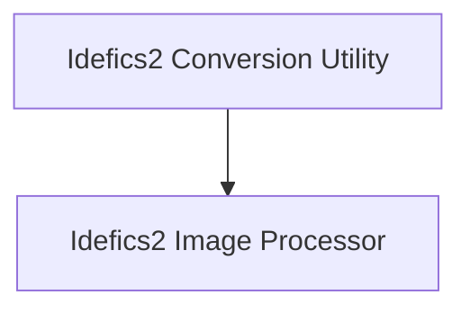

# Idefics2 Models Documentation

The `idefics2_models` module provides essential functionalities for working with Idefics2 models, including utilities for converting model weights to the Hugging Face format and a specialized image processor for handling image inputs.

## Architecture Overview

This module is composed of two primary sub-modules:

<!-- DIAGRAM_JSON
{
    "direction": "TD",
    "nodes": [
        {"id": "idefics2_conversion_utility", "label": "Idefics2 Conversion Utility", "type": "module", "link": "idefics2_conversion_utility.md"},
        {"id": "idefics2_image_processor", "label": "Idefics2 Image Processor", "type": "module", "link": "idefics2_image_processor.md"}
    ],
    "edges": [
        {"source": "idefics2_conversion_utility", "target": "idefics2_image_processor"}
    ],
    "groups": []
}
-->

## Sub-modules

### [Idefics2 Conversion Utility](idefics2_conversion_utility.md)
This sub-module is responsible for converting Idefics2 model weights from their original format to the Hugging Face Transformers compatible format. It ensures seamless integration of Idefics2 models within the Hugging Face ecosystem.

### [Idefics2 Image Processor](idefics2_image_processor.md)
This sub-module offers robust image preprocessing capabilities tailored for Idefics2 models. It handles operations such as resizing, padding, normalization, and image splitting, preparing raw image data for model consumption.
