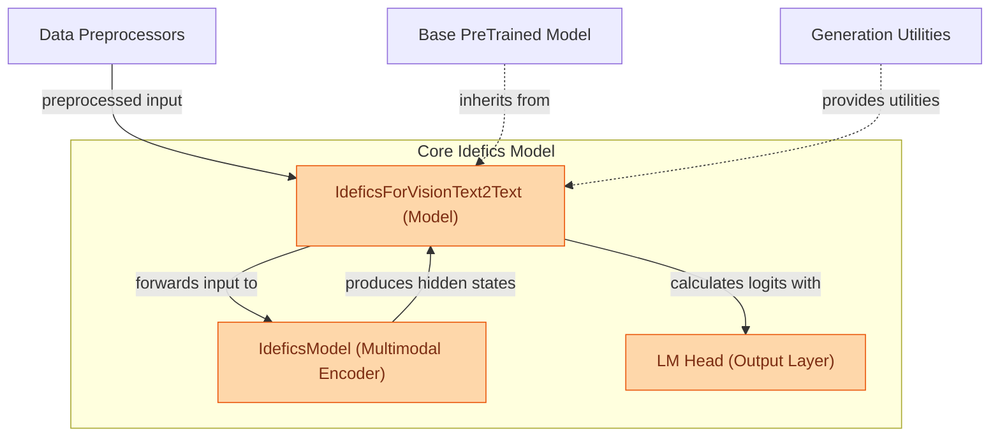

## Idefics Vision-Text Model
This module implements the IdeficsForVisionText2Text model, enabling multimodal text generation by processing both image and text inputs through its integrated architecture.

<!-- DIAGRAM_JSON
{
    "direction": "TD",
    "nodes": [
        {"id": "preprocessors", "label": "Data Preprocessors", "type": "external", "link": "data_preparation.md"},
        {"id": "base_model", "label": "Base PreTrained Model", "type": "component", "link": null},
        {"id": "generation_mixin", "label": "Generation Utilities", "type": "external", "link": "model_utilities/generation.md"},
        {"id": "idefics_model", "label": "IdeficsModel (Multimodal Encoder)", "type": "component", "link": null},
        {"id": "lm_head", "label": "LM Head (Output Layer)", "type": "component", "link": null},
        {"id": "idefics_vision_text2text", "label": "IdeficsForVisionText2Text (Model)", "type": "component", "link": null}
    ],
    "edges": [
        {"source": "preprocessors", "target": "idefics_vision_text2text", "label": "preprocessed input"},
        {"source": "base_model", "target": "idefics_vision_text2text", "label": "inherits from", "arrowhead": "empty"},
        {"source": "generation_mixin", "target": "idefics_vision_text2text", "label": "provides utilities", "arrowhead": "empty"},
        {"source": "idefics_vision_text2text", "target": "idefics_model", "label": "forwards input to"},
        {"source": "idefics_model", "target": "idefics_vision_text2text", "label": "produces hidden states"},
        {"source": "idefics_vision_text2text", "target": "lm_head", "label": "calculates logits with"}
    ],
    "groups": [
        {"id": "core_idefics", "label": "Core Idefics Model", "role": "generative", "nodes": ["idefics_vision_text2text", "idefics_model", "lm_head"]}
    ]
}
-->
