# Module: `image_processing`

The `image_processing` module provides a comprehensive suite of functionalities for preparing and manipulating images and their associated annotations across various models, including Chameleon, DETR, MLlama, Nougat, and SuperGlue. It encompasses core transformations like resizing, scaling, normalization, and padding, and offers specialized post-processing capabilities for tasks such as object detection, semantic segmentation, and panoptic segmentation.

## Architecture and Component Relationships

The `image_processing` module integrates different image processor implementations to cater to specific model requirements while leveraging common image manipulation utilities. Key components include `ChameleonImageProcessor` (and `ChameleonImageProcessorPil`) for Chameleon models, `DetrImageProcessorPil` for DETR models, `MllamaImageProcessorPil` for MLlama models, `NougatImageProcessorPil` for Nougat models, and `SuperGlueImageProcessorPil` for SuperGlue models, all extending `PilBackend` from the [image_utilities](image_utilities.md) module.

<!-- DIAGRAM_JSON
{
    "direction": "TD",
    "nodes": [
        {"id": "chameleon_image_processor", "label": "ChameleonImageProcessor", "type": "component", "link": null},
        {"id": "detr_image_processor_pil", "label": "DetrImageProcessorPil", "type": "component", "link": null},
        {"id": "nougat_image_processor_pil", "label": "NougatImageProcessorPil", "type": "component", "link": null},
        {"id": "mllama_image_processor_pil", "label": "MllamaImageProcessorPil", "type": "component", "link": null},
        {"id": "superglue_image_processor_pil", "label": "SuperGlueImageProcessorPil", "type": "component", "link": null},
        {"id": "pil_backend", "label": "PilBackend", "type": "external", "link": "image_utilities.md"},
        {"id": "chameleon_models", "label": "Chameleon Models", "type": "external", "link": "chameleon_models.md"},
        {"id": "detr_models", "label": "DETR Models", "type": "external", "link": "detr_models.md"},
        {"id": "nougat_models", "label": "Nougat Models", "type": "external", "link": "nougat_models.md"},
        {"id": "mllama_models", "label": "Mllama Models", "type": "external", "link": "mllama_models.md"},
        {"id": "superglue_models", "label": "SuperGlue Models", "type": "external", "link": "superglue_models.md"},
        {"id": "torch_library", "label": "PyTorch Library", "type": "external", "link": null},
        {"id": "pillow_library", "label": "Pillow Library", "type": "external", "link": null}
    ],
    "edges": [
        {"source": "chameleon_image_processor", "target": "pil_backend", "label": "inherits"},
        {"source": "detr_image_processor_pil", "target": "pil_backend", "label": "inherits"},
        {"source": "nougat_image_processor_pil", "target": "pil_backend", "label": "inherits"},
        {"source": "mllama_image_processor_pil", "target": "pil_backend", "label": "inherits"},
        {"source": "superglue_image_processor_pil", "target": "pil_backend", "label": "inherits"},
        {"source": "chameleon_image_processor", "target": "chameleon_models", "label": "preprocesses for"},
        {"source": "chameleon_models", "target": "chameleon_image_processor", "label": "outputs to"},
        {"source": "detr_image_processor_pil", "target": "detr_models", "label": "preprocesses for"},
        {"source": "detr_models", "target": "detr_image_processor_pil", "label": "outputs to"},
        {"source": "nougat_image_processor_pil", "target": "nougat_models", "label": "preprocesses for"},
        {"source": "nougat_models", "target": "nougat_image_processor_pil", "label": "outputs to"},
        {"source": "mllama_image_processor_pil", "target": "mllama_models", "label": "preprocesses for"},
        {"source": "mllama_models", "target": "mllama_image_processor_pil", "label": "outputs to"},
        {"source": "superglue_image_processor_pil", "target": "superglue_models", "label": "preprocesses for"},
        {"source": "superglue_models", "target": "superglue_image_processor_pil", "label": "outputs to"},
        {"source": "superglue_image_processor_pil", "target": "torch_library"},
        {"source": "superglue_image_processor_pil", "target": "pillow_library"}
    ],
    "groups": []
}
-->

```mermaid
graph TD
    chameleon_image_processor[ChameleonImageProcessor]
    detr_image_processor_pil[DetrImageProcessorPil]
    nougat_image_processor_pil[NougatImageProcessorPil]
    mllama_image_processor_pil[MllamaImageProcessorPil]
    superglue_image_processor_pil[SuperGlueImageProcessorPil]
    pil_backend[PilBackend]
    chameleon_models[Chameleon Models]
    detr_models[DETR Models]
    nougat_models[Nougat Models]
    mllama_models[Mllama Models]
    superglue_models[SuperGlue Models]
    torch_library[PyTorch Library]
    pillow_library[Pillow Library]

    chameleon_image_processor -- inherits --> pil_backend
    detr_image_processor_pil -- inherits --> pil_backend
    nougat_image_processor_pil -- inherits --> pil_backend
    mllama_image_processor_pil -- inherits --> pil_backend
    superglue_image_processor_pil -- inherits --> pil_backend

    chameleon_image_processor -- preprocesses for --> chameleon_models
    chameleon_models -- outputs to --> chameleon_image_processor

    detr_image_processor_pil -- preprocesses for --> detr_models
    detr_models -- outputs to --> detr_image_processor_pil

    nougat_image_processor_pil -- preprocesses for --> nougat_models
    nougat_models -- outputs to --> nougat_image_processor_pil

    mllama_image_processor_pil -- preprocesses for --> mllama_models
    mllama_models -- outputs to --> mllama_image_processor_pil

    superglue_image_processor_pil -- preprocesses for --> superglue_models
    superglue_models -- outputs to --> superglue_image_processor_pil
    superglue_image_processor_pil --> torch_library
    superglue_image_processor_pil --> pillow_library
```

## Core Functionality

The `image_processing` module offers specialized components to handle diverse image processing needs:

### `ChameleonImageProcessor` and `ChameleonImageProcessorPil` (for Chameleon Models)

These processors primarily focus on:
-   **RGB Conversion**: Robustly convert images to RGB format, handling alpha channels by blending with a white background.
-   **Image Backend Support**: Provide implementations for different image processing backends (e.g., Torchvision, PIL) to ensure flexibility and optimization.
-   Refer to [chameleon_image_processors](chameleon_image_processors.md) for more detailed information.

### `DetrImageProcessorPil` (for DETR Models)

This processor is dedicated to preparing images and annotations for DETR models and interpreting their outputs:
-   **Initialization**: Configures parameters for resizing, scaling, normalization, and padding.
-   **Annotation Preparation**: Converts raw COCO detection or panoptic annotations into a DETR-compatible format.

### `MllamaImageProcessorPil` (for MLlama Models)

The `MllamaImageProcessorPil` class is the central part of this module for MLlama models, extending `PilBackend` to offer specific image manipulation capabilities tailored for the MLlama model. It defines a series of default parameters for image manipulation and validates them upon initialization.

**Attributes:**

*   `resample`: Resampling filter for resizing (default: `PILImageResampling.BILINEAR`).
*   `image_mean`: Mean values for image normalization (default: `IMAGENET_STANDARD_MEAN`).
*   `image_std`: Standard deviation values for image normalization (default: `IMAGENET_STANDARD_STD`).
*   `size`: Target size for images (default: `{"height": 224, "width": 224}`).
*   `do_resize`, `do_rescale`, `do_normalize`, `do_convert_rgb`, `do_pad`: Boolean flags to enable/disable specific preprocessing steps.
*   `max_image_tiles`: Maximum number of tiles an image can be split into (default: 4).
*   `model_input_names`: List of expected input names for the model (`"pixel_values"`, `"num_tiles"`, `"aspect_ratio_ids"`, `"aspect_ratio_mask"`).

**Methods:**

*   `__init__(self, **kwargs)`:
    Initializes the processor with given keyword arguments and validates preprocessing parameters.

*   `preprocess(self, images: ImageInput, **kwargs: Unpack[MllamaImageProcessorKwargs]) -> BatchFeature`:
    The main entry point for image preprocessing. It calls the `preprocess` method of the base class, which orchestrates the entire pipeline.

*   `_prepare_images_structure(self, images: ImageInput, expected_ndims: int = 3) -> ImageInput`:
    Prepares raw image inputs into a standardized nested list structure for further processing.

*   `convert_to_rgb(self, image: ImageInput) -> ImageInput`:
    Ensures the image is in RGB format, which is often a requirement for deep learning models.

*   `pad(self, image: np.ndarray, size: dict[str, int], aspect_ratio: tuple[int, int]) -> np.ndarray`:
    Pads the input image to match a target `size` multiplied by an `aspect_ratio`. This is crucial for creating a canvas that can be evenly divided into tiles.

*   `resize(self, image: np.ndarray, size: SizeDict, max_image_tiles: int, resample: PILImageResampling | None = None) -> tuple[np.ndarray, tuple[int, int]]`:

### `SuperGlueImageProcessorPil` (for SuperGlue Models)
`src.transformers.models.superglue.image_processing_pil_superglue.SuperGlueImageProcessorPil`

This class is responsible for the entire image processing pipeline for SuperGlue models when using the PIL backend. It inherits from `PilBackend` (from the [image_utilities](image_utilities.md) module) and provides methods for preprocessing and post-processing images.

**Key Features:**

*   **Initialization**: Configures parameters such as default image size, resampling method, rescaling factor, and whether to convert images to grayscale.
*   **Preprocessing (`preprocess` and `_preprocess`)**:
    *   Handles image input validation and flattening of image pairs.
    *   Resizes images to a target `size` (default 480x640) using bilinear resampling.
    *   Rescales pixel values by a `rescale_factor` (default 1/255).
    *   Converts images to grayscale.
    *   Organizes processed images into pairs within a `BatchFeature` object.
*   **Post-processing Keypoint Matching (`post_process_keypoint_matching`)**:
    *   Takes raw outputs from a SuperGlue model and converts them into lists of keypoints, scores, and descriptors.
    *   Adjusts keypoint coordinates to be absolute to the original image sizes.
    *   Filters out matches based on a `threshold` score.
    *   Requires the PyTorch library for tensor operations.
*   **Visualization (`visualize_keypoint_matching`)**:
    *   Plots image pairs side-by-side.
    *   Draws detected keypoints and matching lines between them.
    *   Colors matching lines based on their score for visual interpretation.
    *   Utilizes the Pillow library for image drawing.

    Resizes an image to fit optimally within a tiled canvas, respecting its aspect ratio and the `max_image_tiles` constraint. It returns the resized image and the calculated number of tiles in height and width.

*   `_preprocess(self, images: list[list[np.ndarray]], ...) -> BatchFeature`:
    The internal method that implements the detailed preprocessing steps:
    1.  Resizes and pads each image in the batch.
    2.  Applies optional rescaling and normalization.
    3.  Splits the processed images into multiple tiles.
    4.  Packs these tiles and generates `aspect_ratio_ids` and `aspect_ratio_mask` for the model's input.

-   **Image & Annotation Resizing**: Resizes images and corresponding bounding boxes, areas, and segmentation masks.
-   **Annotation Normalization**: Normalizes bounding box coordinates to a [0, 1] range.
-   **Image Padding**: Pads images to a uniform size within a batch and generates pixel masks, updating annotations accordingly.
-   **Preprocessing Pipeline**: Manages the entire preprocessing workflow: resize, rescale, normalize, and pad images and annotations.
-   **Object Detection Post-processing**: Converts raw model outputs into final bounding box predictions (scores, labels, boxes).
-   **Semantic Segmentation Post-processing**: Generates semantic segmentation maps from model outputs.
-   **Instance Segmentation Post-processing**: Produces individual instance segmentation masks with associated labels and scores.
-   **Panoptic Segmentation Post-processing**: Combines semantic and instance segmentation for comprehensive scene understanding.

### `NougatImageProcessorPil` (for Nougat Models)

The `NougatImageProcessorPil` class is a specialized image processor built upon the `PilBackend`. It extends the base functionality with specific methods tailored for document image processing.

Key functionalities include:
-   **`preprocess(images: ImageInput, **kwargs) -> BatchFeature`**: The main entry point for processing a batch of images. It orchestrates all defined transformation steps.
-   **`crop_margin(image: np.ndarray, gray_threshold: int = 200) -> np.ndarray`**: Identifies and removes gray margins from images, which is crucial for cleaning document scans. It uses internal helper functions `python_find_non_zero` and `python_bounding_rect` for margin detection.
-   **`align_long_axis(image: np.ndarray, size: SizeDict) -> np.ndarray`**: Rotates the image to ensure its longest axis aligns with the longest dimension specified in the target size, improving consistency for models.
-   **`thumbnail(image: np.ndarray, size: SizeDict) -> np.ndarray`**: Resizes the image to create a thumbnail, ensuring no dimension exceeds the corresponding target size.
-   **`pad_images(image: np.ndarray, size: SizeDict) -> np.ndarray`**: Adds padding to images to reach a target size, centering the original image within the new dimensions.
-   **`resize(image: np.ndarray, size: SizeDict, resample: "PILImageResampling | None" = None, reducing_gap: int | None = None, **kwargs) -> np.ndarray`**: Resizes an image to specific dimensions using the configured resampling filter.
-   **`_preprocess`**: An internal method that defines the ordered sequence of image transformations applied to each image.

### `SuperGlueImageProcessorPil` (for SuperGlue Models)
`src.transformers.models.superglue.image_processing_pil_superglue.SuperGlueImageProcessorPil`

This class is responsible for the entire image processing pipeline for SuperGlue models when using the PIL backend. It inherits from `PilBackend` (from the [image_utilities](image_utilities.md) module) and provides methods for preprocessing and post-processing images.

**Key Features:**

*   **Initialization**: Configures parameters such as default image size, resampling method, rescaling factor, and whether to convert images to grayscale.
*   **Preprocessing (`preprocess` and `_preprocess`)**:
    *   Handles image input validation and flattening of image pairs.
    *   Resizes images to a target `size` (default 480x640) using bilinear resampling.
    *   Rescales pixel values by a `rescale_factor` (default 1/255).
    *   Converts images to grayscale.
    *   Organizes processed images into pairs within a `BatchFeature` object.
*   **Post-processing Keypoint Matching (`post_process_keypoint_matching`)**:
    *   Takes raw outputs from a SuperGlue model and converts them into lists of keypoints, scores, and descriptors.
    *   Adjusts keypoint coordinates to be absolute to the original image sizes.
    *   Filters out matches based on a `threshold` score.
    *   Requires the PyTorch library for tensor operations.
*   **Visualization (`visualize_keypoint_matching`)**:
    *   Plots image pairs side-by-side.
    *   Draws detected keypoints and matching lines between them.
    *   Colors matching lines based on their score for visual interpretation.
    *   Utilizes the Pillow library for image drawing.

## Integration with the Overall System

The `image_processing` module is a vital component in the data pipeline for various vision models.

-   **Input Data Standardization**: It standardizes raw image and annotation inputs for different models, ensuring consistent formatting and readiness for model inference or training.
-   **Model-Specific Pre/Post-processing**: By providing model-specific processors like `ChameleonImageProcessor`, `DetrImageProcessorPil`, `MllamaImageProcessorPil`, `NougatImageProcessorPil`, and `SuperGlueImageProcessorPil`, it tailors the processing steps to the unique requirements of each model architecture.
-   **Facilitating Model Output Interpretation**: The post-processing functionalities enable easy interpretation of raw model predictions, translating complex numerical outputs into actionable visual information for diverse computer vision tasks.
-   **Leveraging Common Utilities**: Its reliance on the [image_utilities](image_utilities.md) module, specifically `PilBackend`, promotes efficient reuse of fundamental image manipulation operations and maintains consistency across the system.
-   **Support for Diverse Vision Tasks**: The module supports a wide array of vision tasks, from basic image classification to advanced object detection and segmentation, by adapting its processing logic to the specific needs of each task and model.

