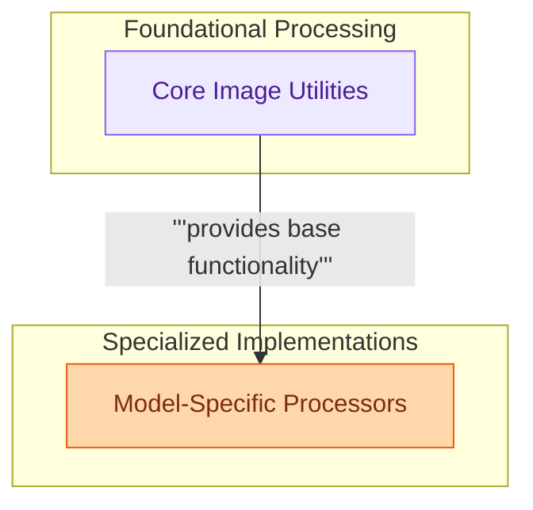

# Image Processors
This module centralizes image processing functionalities, offering both general-purpose utilities and specialized processors tailored for various models to handle diverse image transformations and prepare data for model inference.

<!-- DIAGRAM_JSON
{
    "direction": "TD",
    "nodes": [
        {
            "id": "core_image_utilities",
            "label": "Core Image Utilities",
            "type": "module",
            "link": "core_image_utilities.md"
        },
        {
            "id": "model_specific_processors",
            "label": "Model-Specific Processors",
            "type": "module",
            "link": "model_specific_processors.md"
        }
    ],
    "edges": [
        {
            "source": "core_image_utilities",
            "target": "model_specific_processors",
            "label": "provides base functionality"
        }
    ],
    "groups": [
        {
            "id": "foundations",
            "label": "Foundational Processing",
            "role": "analytical",
            "nodes": [
                "core_image_utilities"
            ]
        },
        {
            "id": "specialized_implementations",
            "label": "Specialized Implementations",
            "role": "generative",
            "nodes": [
                "model_specific_processors"
            ]
        }
    ]
}
-->

