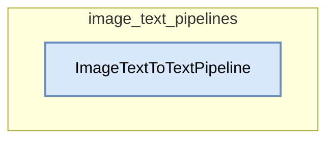

# image_text_pipelines
This module provides the `ImageTextToTextPipeline` for generating text from images and accompanying text, supporting both single-turn and conversational interactions.

<!-- DIAGRAM_JSON
{
    "nodes": [
        {
            "id": "N1",
            "label": "ImageTextToTextPipeline",
            "metadata": {
                "type": "class"
            }
        }
    ],
    "edges": [],
    "groups": [
        {
            "id": "G1",
            "label": "image_text_pipelines",
            "nodes": [
                "N1"
            ],
            "metadata": {
                "type": "module"
            }
        }
    ]
}
-->
