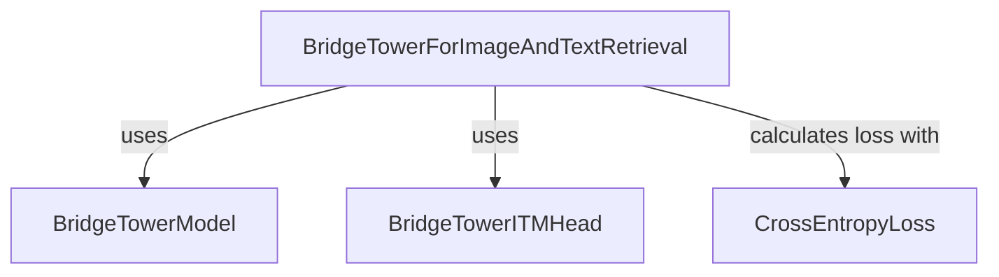

# Module: image_text_retrieval

## Introduction

The `image_text_retrieval` module provides the `BridgeTowerForImageAndTextRetrieval` model, a specialized model built upon the BridgeTower architecture for performing image-text retrieval tasks. Its primary function is to determine the semantic relationship between an image and a textual caption, typically by calculating a matching score. This module is essential for applications requiring understanding and linking visual content with descriptive text.

## Architecture and Component Relationships

The `image_text_retrieval` module leverages core components from the `bridgetower_models` module to achieve its functionality. The central component, `BridgeTowerForImageAndTextRetrieval`, orchestrates the process by utilizing the `BridgeTowerModel` for multimodal feature extraction and the `BridgeTowerITMHead` for computing the image-text matching score.

<!-- DIAGRAM_JSON
{
    "direction": "TD",
    "nodes": [
        {"id": "image_text_retrieval", "label": "BridgeTowerForImageAndTextRetrieval", "type": "component", "link": null},
        {"id": "bridgetower_model", "label": "BridgeTowerModel", "type": "external", "link": "bridgetower_models.md"},
        {"id": "bridgetower_itm_head", "label": "BridgeTowerITMHead", "type": "external", "link": "bridgetower_models.md"},
        {"id": "cross_entropy_loss", "label": "CrossEntropyLoss", "type": "external", "link": null}
    ],
    "edges": [
        {"source": "image_text_retrieval", "target": "bridgetower_model", "label": "uses"},
        {"source": "image_text_retrieval", "target": "bridgetower_itm_head", "label": "uses"},
        {"source": "image_text_retrieval", "target": "cross_entropy_loss", "label": "calculates loss with"}
    ],
    "groups": []
}
-->

### Core Components

#### `BridgeTowerForImageAndTextRetrieval`

-   **Description**: This is the main class within the module, responsible for the end-to-end image-text retrieval process. It takes an image and text as input, processes them through the underlying BridgeTower architecture, and outputs a score indicating their matching probability.
-   **Key Functionality**:
    -   Initializes with a `BridgeTowerModel` for multimodal embedding and a `BridgeTowerITMHead` for the image-text matching score calculation.
    -   The `forward` method processes `input_ids`, `attention_mask`, `token_type_ids`, `pixel_values`, `pixel_mask`, `inputs_embeds`, and `image_embeds` to generate a `pooler_output`.
    -   It then uses the `itm_score` head to compute logits based on the `pooler_output`.
    -   If `labels` are provided, it calculates the image-text matching loss using `CrossEntropyLoss`.
    -   Returns a `SequenceClassifierOutput` containing the loss (if calculated), logits, hidden states, and attentions.
-   **Dependencies**:
    -   `BridgeTowerModel` (from [bridgetower_models.md](bridgetower_models.md)): Used to obtain the multimodal embeddings from image and text inputs.
    -   `BridgeTowerITMHead` (from [bridgetower_models.md](bridgetower_models.md)): A classification head specifically designed for Image-Text Matching (ITM) tasks.
    -   `torch.nn.CrossEntropyLoss`: A standard loss function used for classification tasks.

## How the Module Fits into the Overall System

The `image_text_retrieval` module is a specific application layer built on top of the broader [bridgetower_models.md](bridgetower_models.md) framework. It provides a concrete implementation for the image-text retrieval task, making the advanced multimodal capabilities of BridgeTower accessible for direct use in applications such as image captioning, cross-modal search, or verification of image-text consistency. It effectively wraps the core BridgeTower components with a task-specific head and loss function, streamlining the development of retrieval-focused solutions.
