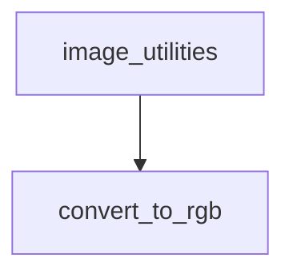

The `image_transforms` module provides essential utility functions for image manipulation within the system. Its primary role is to ensure image data is in the correct format for downstream processing, particularly focusing on color space conversions.

This module is a child of the `image_utilities` module, which encapsulates broader image processing functionalities.

### Core Functionality

The `image_transforms` module currently offers the following key functionality:

*   **`convert_to_rgb`**: This function is designed to convert an input image to the RGB color format. It intelligently checks if the image is a PIL `Image.Image` object and if it's already in RGB mode to avoid unnecessary conversions. It is a critical component for standardizing image inputs across various models and processes that expect RGB format.

### Architecture and Component Relationships

The `image_transforms` module contains the `convert_to_rgb` function as its main component. This function has an implicit dependency on the `Pillow` (PIL) library for image manipulation and explicitly requires a "vision" backend as indicated by the `requires_backends` call, suggesting integration with backend-specific image processing optimizations.

This module serves as a foundational layer for other image-related modules, ensuring that image data is prepared correctly before more complex operations like feature extraction or model inference.

<!-- DIAGRAM_JSON
{
    "direction": "TD",
    "nodes": [
        {"id": "convert_to_rgb_func", "label": "convert_to_rgb", "type": "component", "link": null},
        {"id": "image_utilities", "label": "image_utilities", "type": "external", "link": "image_utilities.md"}
    ],
    "edges": [
        {"source": "image_utilities", "target": "convert_to_rgb_func"}
    ],
    "groups": []
}
-->

### How the Module Fits into the Overall System

The `image_transforms` module plays a crucial role in the image processing pipeline by providing standardized image preprocessing. It acts as an early step to ensure data consistency, particularly for models that specifically require RGB input. By residing under the `image_utilities` module, it contributes to a structured approach for handling all image-related operations. Modules like `image_feature_extraction` (a sibling module under `image_utilities`) or various vision models would typically consume images processed by `image_transforms` to guarantee compatibility and optimal performance.
